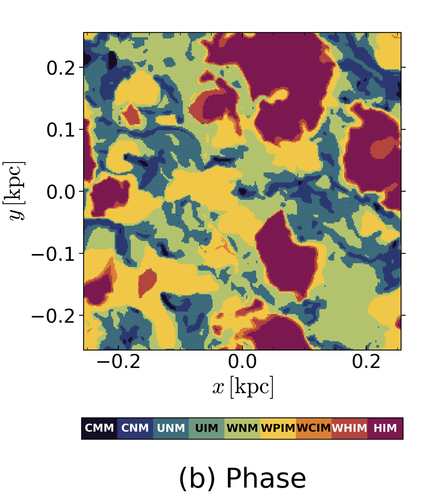
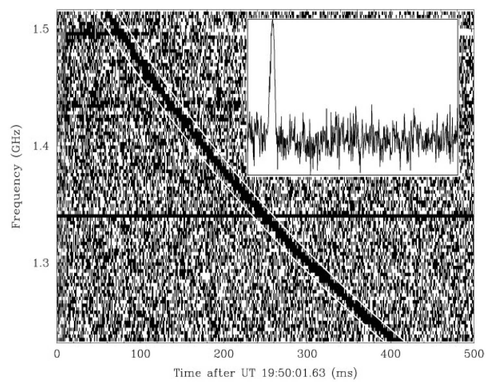
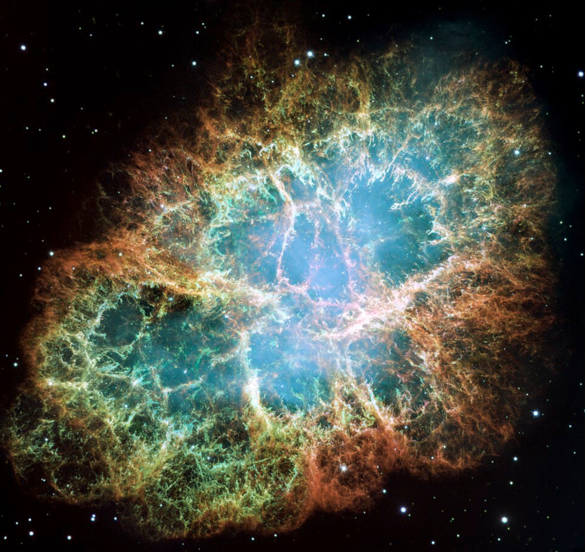

# Diffuse Matter in Space

1. What are the different thermal “phases” of the interstellar medium and how are they detected?

	This is **"The Table"** from [Draine](https://www.amazon.com/Physics-Interstellar-Intergalactic-Princeton-Astrophysics/dp/0691122148), if you don't have this book you should. It is the ultimate reference for anything related to gas in space... which is most of astrophysics. 

	Important things to remember here: 
	
	Main Phases: HIM, HII (WIM), WNM, CNM, Molecular ($H_2$)
	Most of the Energy and Volume in the ISM is in the HIM, 2nd most volume is the WNM. The phase with the most mass is the WNM. 

	

	I personally really like this Screenshot__from the [TIGRESS](http://changgoo.github.io/tigress-web/) simulations which depicts a slice of the ISM in the MW with all the nitty gritty physics included. This gives a general picture of what it all looks like together

	

	There are some other intermediate phases but those don't matter much for the level of understanding we need.

2. What are the most abundant elements in the interstellar medium?

	1. Hydrogen (~70%) – formed from BBN ($H_2$ is formed on dust grains in CNM)
    
	2. Helium (~28%) – forms in stars
	    
	3. Additional elements in order of abundance: C, N, O, S, Si, Cl, Mg, Fe, Na, Al, Ca, etc.

3. Draw the cooling function (cooling rate vs. temperature) for gas of solar composition, and describe the dominant cooling mechanisms in each part of the curve. Distinguish between photoionized and non-photoionized gas in the relevant regime.

	

4. Sketch the interstellar extinction curve labeling the axes and describing its salient features. How could you use extinction as a function of wavelength to constrain the sizes of interstellar dust grains?

	

	Here we define $A_\lambda$ to be the extinction at wavelength $\lambda$ and we define $A_I$ to be the extinction in the I band. We define 
	
	$$R_V \equiv \frac{A_V}{A_B - A_V}$$

	which is known as the "dust reddening" parameter. A typical value is $R_V \approx 3.1$ for the MW. The extinction is related to the optical depth by $A_\lambda \approx \tau_\lambda \approx N_{\rm dust} \sigma_\lambda$ where $N_{\rm dust}$ is the column density of dust and $\sigma_\lambda$ is the cross section of the dust at a given wavelength.

	 If we want to constrain the size of dust grains we must first understand the cross section in the geometric and electric dipole limit. In general we have $\sigma = \sigma_{\rm abs} + \sigma_{\rm sca}$ and $Q_{\rm absorbtion} \equiv \sigma_{\rm absorption} / \pi a^2$ or $Q_{\rm scatter} \equiv \sigma_{\rm scatter} / \pi a^2$.

	If $a \ll \lambda/2\pi$ then we are in the **electric dipole limit** and in this case 
	
	$$Q_{\rm absorbtion} \propto \frac{a}{\lambda^2} \gg Q_{\rm scatter} \longrightarrow A_\lambda\propto \frac{1}{\lambda^2}$$

	If $a \gg \lambda/2\pi$ then we are in the **geometric optics limit** which means that 
	
	$$Q_{\rm absorption} + Q_{\rm scatter} \approx 2 \longrightarrow A_\lambda \propto \rm cst.$$

	Now, by looking at the extinction curves we can learn a few things. 
		1. In the $A_\lambda \propto \lambda^{-2}$ part of the curve, $A_\lambda / A_I$ is large meaning we have a significant amount of dust grains with $a < \lambda/2\pi$ down to $\lambda \sim 0.1 \mu \rm m$ which means we have a lot of dust grains with $a \lesssim 0.1 \mu \rm m / 2 \pi$ 
		2. The **UV Bump** at $\lambda \sim 200 \; \rm \mu m$ is still disputed but likely comes from bonding to anti bonding transition ($\pi \rightarrow \pi^*$) in carbon sheets **found in PAHs and small graphite grains.**
		3. **IR features** are due to **bending and stretching of silicate and carbon bonds in the grains**

5. What is known about the typical composition of interstellar dust?

	Below we plot the distribution of dust grain sizes with appropriate labeling. 
	
	

	Dust grains are made out of **Polycyclic Aromatic Hydrocarbons** which have a neat hexagon like shape (think JWST mirror) which have a characteristic size of $a \sim 10^{-3} \; \rm \mu m$.
	
	

	We also have **Silicates** which are molecules with Silicon and Oxygen and $a_{\rm Si} \sim 0.1 \; \rm \mu m$, lastly we have **Carbonaceous** dust grains which PAHs are a subset of, these dust grains are like graphite and have characteristic size $a_{\rm C} \sim 0.1 - 1 \; \rm \mu m$. 

	We know grains are aspherical from polarization of dust reddened starlight (aka IR polarization). We also know the extinction in the IR is dominated by larger grains which tend to align with the magnetic field. 

	**Fun Fact from Ronan:** PAHs are the same molecule structure as cigarette smoke. 

6. What is the typical temperature of dust grains in the diffuse interstellar medium? What determines the temperature? Can we determine the temperature observationally?

	The typical temperature of dust grains in the ISM is between $T_d \sim 10-30 \; \rm K$. We can determine this via thermal emission in the Infrared 

	

	It is important to remember that **grain heating** is dominated by optical or UV photons whose energy excites vibrational modes. **Grain cooling** is dominated by thermal IR emission. 
	
	We can determine what $T_d$ should be from balancing heating and cooling of the dust grains 
	
	$$\underbrace{4 \pi a^2 \langle Q_{\rm abs}\rangle_{B_\nu} \sigma_{\rm sb} T_d^4}_{\rm cooling} = \underbrace{\pi a^2 \langle Q_{\rm abs}\rangle_* U_* c}_{\rm heating}$$

	where the LHS represents the cooling (we use Stephan Boltzmann Law) and we average over the Blackbody spectrum and the RHS represents the heating (geometric limit --> cross section for photons to hit grain) so we average over the background radiation field. We note both sides of the equation have units of luminosity. If we assume in the LHS case that we are in the **electric dipole limit** then $Q_{\rm abs} \propto a / \lambda^2$ and we can actually approximate the average over the blackbody spectrum as $\langle Q_{\rm abs}\rangle_{B_\nu} \approx Q_{\rm abs}(\lambda = \lambda_{\rm peak})$ where $\lambda_{\rm peak}$ is the wavelength of the peak of the Blackbody spectrum that corresponds to the dust temperature $T_{\rm d}$ (use Wien's law). On the RHS we use the **geometric optics limit** which means that $\langle Q_{\rm abs} \rangle_* \propto \; \rm cst$, if we plug all this in and assume $U_* \approx J_{\rm FUV}$ then we get 
	
	$$T_{\rm d} \approx T_0 \left( \frac{J_{\rm FUV}}{J_{\rm FUV, local}} \right)^{1/6}$$

	where $T_0 \approx 16.4 \; \rm K$ for silicates and $T_0 \approx 22.3 \; \rm K$ for graphite dust grains. 
	 

7. Explain why the CO molecule is used as a tracer of the molecular gas content of galaxies. What is the justification for the often-used assumption that the total mass of molecular gas can be calculated from the CO line flux? Under what circumstances might this assumption be invalid?

	Observationally, all we have to do is find $\lambda_{\rm peak}$ using an IR telescope which we can then relate to a dust grain temperature by Wien's law 
	
	$$T_{\rm d} \lambda_{\rm peak} \approx 2900 \; \rm \mu m \; K \longrightarrow T_{\rm d} \approx 25 \; \rm K \;\; .$$

	CO is used as a tracer of molecular hydrogen because CO has **strong rotational transitions** that are easily excited due to the large permanent dipole moment, meanwhile **$H_2$ has no permanent dipole moment** and thus far weaker lines that are effectively undetectable. 

	$H_2$ either has quadrupolar rotational transitions or vibrational transitions that are not excited due to cold temperatures. 

	The most useful CO rotational transitions are 
		1. CO $J = 1 \rightarrow 0$ at $2.6 \; \rm mm$, corresponding to $115 \; \rm GHz$ 
		2. CO $J = 2 \rightarrow 1$ at $1.3 \; \rm mm$, corresponding to $230 \; \rm GHz$ 

	We can relate the column density of molecular hydrogen to the line strength of CO by 
	
	$$N_{H_2} \approx X_{\rm CO} W_{\rm CO}$$

	where we denote the CO-X-factor as $X_{\rm CO}$ and the line strength of CO as $W_{\rm CO}$. We **assume the molecular cloud is optically thick to the CO lines**, that $X_{\rm CO}$ is **independent of the abundance of CO in the optically thick limit**. If $n_{\rm H} \sim 10^{3} \; \rm cm^{-3}$ and $T_{\rm exc} \sim 10 \; \rm K$ then we would expect $X_{\rm CO} \sim 10^{20} \; \rm cm^{-2} \; K^{-1} \; (km/s)^{-1}$

	Some problems that come with doing this is baked in our assumptions. The $X_{\rm CO}$ factor could be different in other galaxies. An important result from our homework assignments was that 
	
	$$X_{\rm CO} \propto \left(\frac{R}{f_C \sigma_v}\right)^{1/2} \propto f_C^{-1/2} n_{\rm H}^{-1/4}$$

	where $R$ is the radius of the molecular cloud, $f_C$ is the carbon fraction, and $\sigma_v$ is the velocity dispersion. 
	
	In starburst galaxies we can assume that the density and abundance of $f_C$ will generally be higher than in the Milky Way due to higher metallicity, so we would expect the $X_{\rm CO}$ **to be overestimated** if we assumed that $X_{\rm CO}$ was held constant at the fixed Solar neighborhood value! On the other hand, for dwarf galaxies we expect them to have low density and metal abundance which means that if we assumed that $X_{\rm CO}$ was held constant at the fixed Solar neighborhood value, then we would **expect to underestimate** the $X_{CO}$ value.

	$N_{\rm H_2}$ **could also be over or under estimated** by 
		1. **Under**: Outer layers of molecular clouds are hit by dissociating radiation and therefore $X_{\rm CO} W_{\rm CO}$ underestimates $N_{H_2}$ because CO is dissociated on the outskirts and then becomes optically thin. 
		2. **Over:** partial ISM pressure confinement of clouds leads to the inner $\sigma_v^2 \uparrow$ which will decrease the optical depth and will thus overestimate $N_{H_2}$.  

8. How can the abundance of deuterium be determined in interstellar gas? Why is it interesting?

	We can measure Deuterium abundance $^2 H$ with atomic transitions! Since deuterium atoms are heavier by $H$ atoms by a neutron then we expect the transitions to be shifted ever so slightly by the ratio of the reduced masses 

	$$\frac{\Delta \lambda}{\lambda} \approx \frac{1 + m_e / m_p}{1 + m_e / 2m_p} \approx 1.00027$$

	which leads to a **blueshift** of $\Delta v = \frac{\Delta \lambda} c \approx 82 \; \rm km/s$. This can be observably different than standard hydrogen lines. If we observe ratios of $^2 H/H$ lines then we can get a **relative abundance** of which we find deuterium to be 20 ppm of Hydrogen. 

	This is interesting because deuterium is only formed during BBN, so if we measure the abundance of deuterium relative to hydrogen then we **can constrain BBN in cosmology**. Specifically, if $\Omega_b$ is larger then there will be more free neutrons in BBN (first few minutes of the universe) to form $^4 \rm He$ leading to an earlier freeze out for deuterium which will mean we would see a lower abundance of deuterium. In short $\Omega_b$ is inversely correlated with deuterium abundance!

	Furthermore, deuterium is **destroyed by stars**, so the $^2 H/H$ ratio in a galaxy relative to primordial abundance tells you about the **Star Formation History**. Deuterium can also be deposited onto dust --> deficit of deuterium in the gas phase. 

9. Describe how the oxygen abundance in the interstellar medium is determined using observations of emission lines. 

	In HII regions, emission line strengths can be used to determine Oxygen abundances. We can use transitions in $\rm [OIII]$ to determine the electron temperature $T_e$ which we then use this temperature to infer Oxygen abundances from O to H line ratios. This only works in low density regions where lines are **collisionally excited** and then **radiatively de-excited** (forbidden transition which violates quantum selection rules).

	In detail this method starts with detailed balance (see figure below for the $\rm [OIII]$ line)

	$$n_0 C_{04} = n_4(A_{43} + A_{41}) \;\;\;\;\;\; \& \;\;\;\;\;\; n_4 A_{43} + n_0 C_{03} = n_3(A_{32} + A_{31})$$

	$$P(4 \rightarrow 3) = E_{43} (n_0 C_{04}) \frac{A_{43}}{A_{43} + A_{41}} \;\;\;\;\;\; \& \;\;\;\;\;\; P(3 \rightarrow 2) = E_{32} \left[ n_0 C_{03} + n_0 C_{04} \frac{A_{43}}{A_{43} + A_{41}} \right] \frac{A_{32}}{A_{32} + A_{31}}$$ 
	
	and then 
	
	$$\frac{j(4 \rightarrow 3)}{j(3 \rightarrow 2)} = \frac{A_{43} E_{43}}{A_{32} E_{32}} \frac{n_4}{n_3} = \frac{A_{43} E_{43} (A_{32} + A_{31}) \Omega_{04} e^{-E_{43}/kT_e}}{A_{32} E_{32} \left[ (A_{43} + A_{41}) \Omega_{03}  + A_{43}e^{-E_{43}/kT_e}\right]}$$ 

	Then we solve for $T_{\rm e}$! We note the collisional excitation rate coefficient is written as 
	
	$$C_{\ell u} \approx 9 \times 10^{-8} T_4^{-1/2} \frac{\Omega_{\ell u}}{g_\ell} e^{-E_{u \ell}/kT} \; \rm cm^3 s^{-1}$$ 
	
	Once we have $T_e$, we can determine the O abundance by comparing the O line flux to Balmer series lines like $\rm H\beta$: 
	
	$$\frac{j(\rm [OIII]_{3 \rightarrow 2} )}{j(\rm H\beta)} = \frac{n(\mathrm{OIII}) A_{32} E_{32} (n_3/n_0)}{n(\mathrm{H}^+) \alpha_{\rm eff, H\beta} E_{\rm H\beta}}$$ 

	In this case, everything is a function of $T_e$ so we can solve for $n(\mathrm{[OIII]}) / n(\rm H^+)$. This can also be done for the $\rm [OII]$ line, and since $n(0) \approx n(\mathrm{[OII]}) + n(\mathrm{[OIII]})$ in HII regions, we get $\sim n(0)$. If the 4->3 transition is weak then this method fails and one needs to use an empirical parameter $R_{23}$ instead 
	
	$$R_{23} \equiv \frac{j(\mathrm{[OII]_{2 \rightarrow 0}}) + j(\mathrm{[OIII]_{3 \rightarrow 2}}) + j(\mathrm{[OIII]_{3 \rightarrow 1}})}{j(\rm H\beta)} \; .$$
	
	You can determine gas phase metallicity $12 + \log(\rm O/H)$ with a cubic polynomial in $R_{23}$ (therefore $\rm [OII]$ and $\rm [OIII]$ emission lines along with the $\rm H\beta$ emission line can be used to measure gas phase metallicity in other galaxies). 

	

10. Using dimensional analysis, derive the Jeans mass, and discuss its relevance to astrophysics. What is the typical value of the Jeans mass in giant molecular clouds?

	This is quite easy, we know $M_J \propto c_s^a G^b \rho^c$ using dimensional analysis we find that 
	
	$$M_J \propto \frac{c_s^3}{G^{3/2} \rho^{1/2}}$$
	
	This mass is important for gravitational collapse of cold molecular gas into stars! It sets the lower limit for overdensity --> collapse --> stars. This also applies to large scale structure too. 

	In molecular clouds with $n_{H} \sim 10^4 \; \rm cm^{-3}$ we find $M_J \sim 1-2 M_\odot$, which is consistent with the observed IMF.

11. Consider the evolution of a supernova remnant. Assuming for simplicity a uniform ambient density surrounding the initial explosion site, use dimensional analysis to find an expression for radius vs. time during the Sedov-Taylor stage of evolution. Also describe the requirements to enter this stage from the previous stage, and what causes this stage to end.

	We have 3 main stages in the evolution of a supernova remnant. 

	I) **Free Expansion:** The supernova goes off and immediately the blast wave is ballistic with an initial ejection velocity of 
	
	$$v_{\rm ej} \sim \sqrt{\frac{2 E_{\rm SN}}{M_{\rm ej}}} \sim 10^4 \; \rm km/s$$
	
	if we assume $M_{\rm ej} \sim 1 \; M_\odot$ and $E_{\rm SN} \sim 10^{51} \; \rm ergs$. The shock will sweep up the surrounding gas with radius $r_{\rm ej} \sim v_{\rm ej} t$. This **stage ends when** the mass of the shocked shell is comparable to the mass of the ejecta 
	
	$$M_{\rm sh} = \frac{4\pi}{3}r_{\rm sh}^3 \rho = M_{\rm ej} \; .$$

	II) **Sedov-Taylor Self-Similar Solution:** The blast wave continues to expand adiabatically as radiative losses can be neglected. This evolution is self-similar, the radius as a function of time is given by 
	
	$$r_{\rm sh} \propto E_{\rm SN}^{1/5} \rho^{-1/5} t^{2/5} \; .$$

	As the blast wave expands, it is characterized by a hot bubble-like cavity enclosed by a thin outer shell containing most of the mass. Just interior of this shell, radiative cooling begins to become non-negligible and will effectively cool the gas just interior to the outer shell, we technically enter the "radiative phase" when a 3rd of the shock energy is dissipated via this cooling but it's more so just describing the departure from the Sedov-Taylor solution as the blast wave cools. The cooling timescale is about $t_{\rm rad} \sim 50 \; \rm kyr$. **We leave this phase when** $t \approx t_{\rm rad}$. 

	III) **Snowplow Phase:** The cooling just interior to the outer shell causes the thermal pressure just behind the shock to drop suddenly causing the shock to briefly stall. The hot **interior gas within the bubble is still super hot and hasn't cooled, which imparts a strong outward pressure on the cooler dense outer shell**. This is why it's called the snowplow, you have a very dense cool outer layer being pushed by the pressure of the hot (where radiative cooling is unimportant) interior. The mass of the dense shell increases as it "sweeps up" everything in it's path and the interior is only cooling by **adiabatic expansion**. The kinetic energy is then transferred into the surrounding ISM obeying momentum conservation. This **phase ends when** $v_{\rm sh} \sim c_s$, as it just becomes a sound wave. 

12. What is meant by a “shock” in astrophysics? What is meant by a “strong” shock and an “adiabatic” shock? What is the jump in density across a strong adiabatic shock? What is meant by an “isothermal” shock? Discuss the jump in density across a strong isothermal shock.

	The most important thing to remember here is the **Rankine-Hugenoit Jump Conditions** which come from the divergence term in the conservative form of the MHD Fluid Equations 

	$$\mathrm{Mass: \;} \frac{\partial \rho}{\partial t} + \nabla \cdot (\rho\mathbf{u}) = 0$$ 
	
	$$\mathrm{Momentum: \;} \frac{\partial (\rho \mathbf{u})}{\partial t} + \nabla \cdot (\rho \mathbf{u} \otimes \mathbf{u} + P \mathbf{I} - \mathbf{M}) = 0$$

	$$\mathrm{Energy: \;} \frac{\partial}{\partial t} \left(\underbrace{\frac{1}{2}\rho u^2}_{\rm kinetic} + \underbrace{\frac{P}{\gamma - 1}}_{\rm thermal} + \underbrace{\frac{B^2}{8 \pi}}_{\rm magnetic}  \right) + \nabla \cdot \left(\mathbf{u} \left(\rho u^2 + \frac{\gamma}{\gamma - 1}P \right) + \frac{(\mathbf{B} \times \mathbf{u}) \times \mathbf{B}}{4 \pi} \right) = 0$$

	where we define the magnetic momentum tensor 
	
	$$\mathbf{M} \equiv \frac{1}{4\pi}\left( \mathbf{B} \otimes \mathbf{B} - \frac{1}{2} B^2 \mathbf{I} \right)$$

	and one can similarly define a gravity tensor for the momentum equation which is just subtracted in the divergence term 
	
	$$\mathbf{G} \equiv \frac{1}{4\pi G} \left( \nabla \Phi \nabla \Phi - \frac{1}{2} |\nabla \Phi|^2 \mathbf{I} \right)$$

	Lastly, in Ideal MHD we also have $\nabla \cdot \mathbf{B} = 0$ which provides an additional condition. By staring at the divergence term and thinking about what is conserved we arrive at the following jump conditions

	$$\rho_1 u_1 = \rho_2 u_2$$

	$$\rho_1 u_1^2 + P_1 + \frac{B_1^2}{8 \pi} = \rho_2 u_2^2 + P_2 + \frac{B_2^2}{8 \pi}$$

	$$\rho_1 u_1^3 + \frac{\gamma}{\gamma - 1}P_1 u_1 + \frac{u_1 B_1^2}{4 \pi} = \rho_2 u_2^3 + \frac{\gamma}{\gamma - 1}P_2 u_2 + \frac{u_2 B_2^2}{4 \pi}$$

	$$B_1 u_1 = B_2 u_2$$

	 These jump conditions are incredibly powerful. In the unmagnetized case one can derive the ratio of densities, pressures, and temperatures of an ideal gas

	$$\frac{\rho_2}{\rho_1} = \frac{u_1}{u_2} = \frac{(\gamma + 1) \mathcal{M}^2}{2 + (\gamma - 1) \mathcal{M}^2}$$

	$$\frac{P_2}{P_1} = 1 + \frac{2 \gamma}{\gamma + 1}(\mathcal{M}^2 - 1)$$

	$$\frac{T_2}{T_1} = \frac{( 1 - \gamma + 2\gamma \mathcal{M}^2)(2 + (\gamma - 1)\mathcal{M}^2 )}{(\gamma + 1)\mathcal{M}^2}$$

	where we define the sonic Mach number as $\mathcal{M} = u / c_s$ and the sound speed as $c_s^2 = \gamma P / \rho$. One can do this for the MHD case... it's gross.

	Here the important results to remember is that: 
	
	For a **strong adiabatic shock** the compression ratio is constant $\rho_2 / \rho_1 \approx 4$ when $\mathcal{M \gg 1}$ assuming monatomic gas $\gamma = 5/3$ and the other ratios scale with the Mach number squared. 

	For an **isothermal shock** the compression ratio scales $\rho_2 / \rho_1 \sim \mathcal{M}^2$ which means we can get super compressed gas. This can be seen by plugging in $\gamma = 1$ in the equations above and we find that the temperature stays constant across the shock front. This can **only happen when the cooling timescale is short compared to the timescale of the shock (efficient cooling)**.  

	In case you forgot what upstream and downstream shocks mean, here's a diagram that explains what is happening (where $u$ is shock frame velocity and $v$ is lab frame velocity.)

	
	

13. What are dispersion measure (DM) and rotation measure (RM)? How are DM and RM measured, and what properties of the ISM do they probe?

	The **Dispersion Measure (DM)** is 
	
	$$DM \equiv \int n_e dl = -\frac{\pi m_e c}{e^2} \nu^3 \frac{d t_{\rm arrival}}{d \nu}$$ 
	
	and corresponds to the dispersion of light as it travels through electrons (gas). In practice we measure this from tracking the arrival time of the light as a function of frequency which is a quadratic $t_{\rm arrival} \propto \nu^{-2}$ for **Fast Radio Bursts (FRBs)**. A lot of exciting research is being done with FRBs as a means to directly probe the IGM in 3D. The DM can also be used to study $n_e$ in the LOS within the MW or host galaxy. 

	

	The **Rotation Measure** is given by 
	
	$$RM \equiv \frac{e^3}{2 \pi m_e^2 c^4} \int n_e B_{||} dl = \frac{\psi_2 - \psi_1}{\lambda_2^2 - \lambda_1^2}$$

	where $B_{||}$ is the magnetic field along the LOS. The RM is proportional to the rotation in the direction of polarization of EM waves propagating through a cold, magnetized plasma. The RM is determined in observations by measuring the **differences in linear polarization angles** $\psi_1$ and $\psi_2$ at 2 different wavelengths $\lambda_1$ and $\lambda_2$. We can directly measure the magnetic field along the LOS by combining the RM and DM 
	
	$$\langle B_{||}\rangle = \frac{2 \pi m_e^2 c^4}{e^3} \frac{RM}{DM}$$

	Lastly, the **Emission Measure** is given by 
	
	$$EM \equiv \int n_e^2 dl$$

	and is proportional to the emission from an optically thin plasma (e.g. thermal Bremsstrahlung) which is how we measure $n_e$ in hot plasmas from **X-Ray Observations**. 

14. What is the characteristic magnetic field strength of the interstellar medium, and how is it determined? What is the characteristic gas surface density to become “magnetically super-critical,” given this field strength?

	The characteristic B-field strength in the ISM is summarized by

	 

	**HIM**: DM & RM can be measured, the mean LOS magnetic field is given by the ratio of RM to DM (see previous question).

	**WNM/CNM:** HI gas can be studied with 21 cm line. More specifically the B-field can be measured along LOS with the **Zeeman Effect** 
	
	$$\Delta \nu = \frac{e B_{||}}{4 \pi m_e c}$$

	**Molecular:** Zeeman splitting on hydroxyl (**OH**) molecular doublet lines or cyanide (**CN**) rotational transitions. The polarized dust emission due to grain alignment with the magnetic field can also constrain $\langle B_{\perp} \rangle$. 

	We can constrain $\langle B_\perp \rangle$ on galactic scales using the **synchrotron** emission spectrum from **cosmic rays**, but this requires an assumption about the CR energy spectrum. 

	In order for **gravitational collapse** to win over **magnetic pressure** which we call **"magnetically supercritical"**. 

	The condition to be magnetically supercritical is 
	
	$$\frac{\Phi_{\rm B}}{M} < \left( \frac{\Phi_{\rm B}}{M} \right)_{\rm crit} \simeq 2 \pi \sqrt{G}$$ 
	
	which can be derived by setting the magnetic energy density (times a spherical volume) to the gravitational potential energy and recognizing that $\Phi_{\rm B} \propto B \cdot R^2$. We can also express this in terms of surface mass density 
	
	$$\Sigma_{\rm gas} > \Sigma_{\rm crit} \simeq \frac{B}{2 \pi \sqrt{G}} \; ,$$ 
	
	If we assume $B \sim 50 \; \mu G$ then $\Sigma_{\rm crit} \sim 100 \; \rm M_\odot/pc^2$. By this definition, most molecular clouds should be subcritical... for a while people thought the culprit behind this problem was **ambipolar diffusion** (non-ideal MHD effect) which implies that neutrals slide past ion B-field lines which means the magnetic flux goes down, but the timescales are **too long**! The consensus is now that support against gravity is mostly from **small-scale supersonic turbulence** and **anisotropic collapse** allows the overcome of the support.

15. What are the Kelvin–Helmholtz and Rayleigh–Taylor instabilities? Given examples in which these are important to ISM structure and thermodynamics.

	When discussing instabilities we explore how perturbations grow with time. We do linear perturbation theory by exploring how a fluid variable $q$ evolves with the fluid equations. The form of $q$ we use is 
	
	$$q = q_0 + q_1 e^{i(kx - \omega t)}$$ 
	
	so that the operators found in the fluid equations become simple, in other words $\partial_t q_1 \rightarrow -i\omega q_1$ and $\nabla q_1 \rightarrow ik q_1$. With this in mind we can solve for a dispersion relation $\omega^2 = (...)$. We will get an instability if the RHS of the dispersion relation becomes negative because then $\omega$ will have an imaginary component which will grow exponentially (see exponential term in equation above). The imaginary component of $\omega$ is commonly referred to as **the growth rate** $\Gamma$, precisely $\omega = \alpha + \Gamma i$ where $\alpha$ is the real component which is not important to the instability.

	**Kelvin-Helmholtz:** This instability occurs whenever you have two fluids of different densities with some relative shear velocity. The setup is as below 

	

	If there is no magnetic field this setup will always be unstable to perturbations, but if there is a magnetic field along the direction of motion then the magnetic field can act as a stabilizer to the KH instability. The growth rate of the KH instability is given by 
	
	$$\Gamma_{\rm KH} = \sqrt{k_x^2 v^2 \frac{\rho_{\rm I} \rho_{\rm II}}{(\rho_{\rm I} + \rho_{\rm II})^2} - \frac{B_0^2}{2\pi} \frac{k_x^2}{\rho_{\rm I} + \rho_{\rm II}}} \; .$$

	We point attention to the fact that the growth rate is maximized when $\rho_{\rm II} = \rho_{I}$ when there is no magnetic field. If the magnetic field term is greater than the first term then there will be no instability! We show a beautiful gif of this in simulations below. 

	

	The KH instability is found in MANY places, anytime we have two fluids moving shear to each other basically. **Some examples that are relevant to the dynamics of the ISM are shredding of molecular clouds and mixing layers in the ISM between the CNM and WNM** (shameless plug to my undergrad research project below)

	

	**Rayleigh-Taylor:** This instability occurs whenever you have a dense fluid $\rho_{\rm II}$ on top of a less dense fluid $\rho_{\rm I}$ with a downward acceleration field commonly referred to as $g$. We can also have a B-field oriented in the same way as the KH instability (along the x-axis)

	

	This is only unstable in the non-magnetized case when $\rho_{\rm II} > \rho_{\rm I}$. The growth rate of this instability is given by 
	
	$$\Gamma_{\rm RT} = \sqrt{g k_x \frac{\rho_{\rm II} - \rho_{\rm I}}{\rho_{\rm II} + \rho_{\rm I}} - \frac{B_0^2}{2 \pi} \frac{k_x^2}{\rho_{\rm II} + \rho_{\rm I}}}$$

	which has a very similar form to the KH instability growth rate. We can see that if the magnetic field term is greater than the first term we will not have any instability. Interestingly, since the first term and the second term have different powers of $k_x$ we can solve for a stability criterion on perturbation scales. We find that the system is **stable if** 
	
	$$k_x > g \left(\frac{\rho_{\rm II} - \rho_{\rm I}}{B_0^2 / 2\pi} \right) \; ,$$

	which suggests that smaller scales are more stable to this instability which is why we see the large inverted mushroom dip in this instability. In action, this looks like (see [Phillip Mocz's Blog Post](https://philip-mocz.medium.com/create-your-own-finite-volume-fluid-simulation-with-python-part-2-boundary-conditions-source-bda6994b4645) for a cool instructional coding exercise to simulate this in python)

	

	Important scenarios where the RT instability comes up in the dynamics of the ISM is in SNe and the expansion of planetary nebulae 

	
	

16. Draw the thermal equilibrium curve for neutral ISM gas, and use your diagram to explain the stability of different solutions.

	
	
	If we increase the background radiation field $J_{\rm FUV} \uparrow$ then we expect the zero net cooling curve to shift the turnover up and to the right along the constant temperature lines. Similarly if we lower the metallicity $Z \downarrow$  then we get a similar effect. 

	

17. What is an H II region? According to the Strömgen model, how does the radius scale with the luminosity of the ionizing source and the ambient density?

	An HII region occurs when a young massive star (O or B) turns on and emits photoionizing radiation into it's surrounding environment creating an ionized sphere (approximately). We can derive the approximate radius of this spherical model by **balancing the rate of photoionization and case-B radiative recombination** 
	
	$$Q_0 = \frac{4 \pi }{3} R^3 n_H^2 \alpha_B \; ,$$

	where $Q_0 \approx 10^{49} \; \rm s^{-1}$ is the rate of ionizing photons with energy $E > 13.6 \; \rm eV$. We balance by case-B recombination because we make the **on-the-spot approximation**. One can estimate this by computing what the luminosity of an O-type star is and then dividing by the energy of a typical ionizing photon. We can then solve for the Strömgen radius 
	
	$$R_S = \left(\frac{3}{4 \pi} \frac{Q_0}{n^2_H \alpha_B} \right)^{1/3} \propto L^{1/3} n_H^{-2/3} \; .$$

	We note that dust lowers the effective $Q_0$, and the radiation pressure (radiation pressure force $\mathbf{f_{\rm rad}} = F \frac{\kappa \rho}{c}$) pushes dust and gas to the edge of the sphere evacuating the middle.  
	

18. How does the radius of an expanding H II region evolve in time under the Spitzer solution (i.e. driven by pressure of photoionized gas)?

	The evolution of an HII region has two characteristic phases. 
	
	The ionization front produced from the ionizing radiation coming from the hot O or B type star is rapidly expanding at first. The ionization front is moving **Rapidly** relative to the surrounding molecular cloud such that we can treat the surrounding medium as stationary, we call this an **R-Type Ionization Front**. During this phase the radius of the HII region is exponentially expanding 
	
	$$n_0 (4 \pi R_I^2 dR_I) = [Q_0 - \frac{4\pi}{3}R_I^3 \alpha_B n_0^2] dt \;\;\; \longrightarrow \;\;\; R_I^3 = R_{S,o}^3 \left[1 - e^{-t/\tau_{\rm rec}} \right]$$
	
	where $\tau_{\rm rec} \equiv (n_0 \alpha_B)^{-1} \sim 100-1000 \; \rm yrs$. Once the ionization front has expanded to $R_I \approx R_{\rm S,o}$ then we transition into the Spitzer solution. 

	The ionization front switches from **R-type** to **D-type**. Physically what happens is that the ionization front slows down enough such that the molecular hydrogen in the host molecular cloud can **disassociate** $\rm H_2 \rightarrow 2 H \rightarrow 2H^{+} + 2 e^{-}$ in front of the incoming ionization front which **raises the pressure, creating its own shock front** just ahead of the ionization front (**D-Type**). 

	

	The derivation of this is becomes a bit involved requiring the inclusion of radiation in the shock jump conditions, but the upshot is that 
	
	$$R_I \approx R_{S,o}\left[1 + \frac{7}{4} \frac{c_{s,2} (t - t_{\rm s,0})}{R_{s,0}} \right]^{4/7} \propto t^{4/7} \; .$$

	The full evolution of an HII region looks like 

	

19. What is a planetary nebula? What is our current understanding of their formation, morphologies, and lifetimes?

	Planetary nebulae are stellar remnants of stars that expanded to the AGB phase and keep expanding, ultimately blowing away its outer envelope leaving behind a WD core.

	The star has a large mass loss rate due to a strong stellar wind $\dot{M}_{\rm wind} \sim 10^{-4} \; \rm M_\odot /yr$ which happens for $\sim 2 \; \rm kyr$. The WD left behind is super hot with $T_{\rm eff} \sim 10^5 \; \rm K$, effectively being hotter than O stars, this leads to a fully ionized region for $\rm H$ and $\rm He$ while C,N,O are partially ionized in the planetary nebula.

	The WD cools rapidly, enough for gas to recombine after $\sim 10^4 \; \rm yrs$. We find large amounts of C,N,O in planetary nebula which shows evidence of **chemical enrichment**. The mass of a planetary nebula about less than a tenth the mass of the progenitor. So $M \sim 0.1-0.5 \; \rm M_\odot$ with a typical radius of $R \sim 0.1 \; \rm pc$. They tend to have a loose bipolar symmetry and filamentary structure. 

	

20. Describe the various processes that are lumped together by the term “recombination” (radiative, dielectronic, etc.). What is meant by “Case B” recombination?

	Recombination refers to the formation of neutral atoms by ions recombining with free electrons. There are several ways to do this outlined in [Draine](https://www.amazon.com/Physics-Interstellar-Intergalactic-Princeton-Astrophysics/dp/0691122148), we summarize them below

	I) **Radiative Recombination:** $X^+ + e^- \longrightarrow X + h\nu$ 

	II) **Dielectric Recombination:** $X^+ + e^- \longrightarrow X^{**} \longrightarrow X + h\nu$ ($X^{**}$ is an intermediate doubly excited state.)

	III) **Dissociative Recombination:** $AB^+ + e^- \longrightarrow AB^{**} \longrightarrow A + B$ 

	IV) **Charge Exchange:** $X^+ + Y \longrightarrow X + Y^+ + h\nu$  (example: $\rm O^+ + H \longrightarrow O + H^+ + h\nu$ which happens because $\rm H$ is more abundant, so $\rm O$ ions tend to steal $e^-$ from $\rm H$)
	
	V) **Recombination on Dust Grains:** $X^+ + \mathrm{grain}^{+0} \longrightarrow X + \mathrm{grain}^{+1}$ 

	**Case-B Recombination:** Invokes "on-the-spot" approximation. In other words, recombination to the ground state is ignored because it will just produce a $\rm Ly\alpha$ photon that will ionize another atom, producing no net recombinations. This applies when we have a high probability of photon hitting a neutral atom (HII region for example). The case-B recombination coefficient is $\alpha_{\rm B} \sim 3\times10^{-13} T_4^{-0.83} \; \rm cm^{3}/s$. 

21. What is bremsstrahlung? In what astrophysical contexts is it observed? What is synchrotron radiation? In what astrophysical contexts is it observed?

	**Bremsstrahlung** is also known as "Braking Radiation", this is free-free emission corresponding to radiation that is emitted from the **change in acceleration** experienced by charged particles in a plasma as they scatter off of each other. The cooling function looks like 
	
	$$\Lambda_{\rm ff} \propto T^{1/2} Z_i^2 n_i n_e \; .$$
	
	We observe Bremsstrahlung in **hot plasmas**. We can see it in the HIM, HII regions, shock heated gas near SNe remnants, ICM, Accretion Disks around compact objects and AGN. 

	

	**Synchrotron** is radiation produced by charged particles gyrating around a B-field line due to acceleration by the Lorentz force. Relativistic electrons in the ISM emit synchrotron emission in the galactic B-field. The spectrum of synchrotron emission is typically of the form $f_\nu \propto \nu^{-\beta}$ where $\beta \approx 1$. 

	We observe synchrotron in Relativistic AGN jets, in some cases high energy electrons in the jet can scatter photons to higher energies which is called **synchrotron self-compton**. We also observe synchrotron in SNe remnants, pulsar wind nebulae, and GRBs (strong shocks accelerate particles by Fermi acceleration.)

	

22. Sketch the spectrum of continuum emission from the interstellar matter in a galaxy.

	

23. What are some of the important emission lines radiated by interstellar matter in galaxies?

	There are many emission lines radiated by the ISM in galaxies, below is a useful summary of a few that are particularly useful.

|                                Line(s)                                |          Wavelength          |                   Band                   | Class                     | Use                                                                                                                                                                                                                                                                                                                                                                                                                                                                                                                                                                                                |
| :-------------------------------------------------------------------: | :--------------------------: | :--------------------------------------: | ------------------------- | -------------------------------------------------------------------------------------------------------------------------------------------------------------------------------------------------------------------------------------------------------------------------------------------------------------------------------------------------------------------------------------------------------------------------------------------------------------------------------------------------------------------------------------------------------------------------------------------------- |
|                             $\rm H\alpha$                             |           656.3 nm           | Optical | H-recombination Line      | Traces HII regions, typically very bright, thus it is used as an **indicator for star formation** over the last $\sim 10 \; \rm Myr$                                                                                                                                                                                                                                                                                                                                                                                                                                                               |
|                             $\rm H \beta$                             |           486.1 nm           | Optical | H-recombination Line      | Used to compute the **Balmer Decrement** $\rm I(H\alpha) / I(H\beta)$  which is used to estimate **Dust Reddening**. When $n_{\rm e} > 10^4 \; \rm cm^{-3}$ (high densities), collisional effects lead to an increase in high-n energy states $\longrightarrow$ Balmer decrement becomes a diagnostic of $n_{\rm e}$. It can also be used to determine **metallicity** in conjunction with forbidden metal lines.                                                                                                                                                                                  |
|                            $\rm Ly\alpha$                             |           121.6 nm           |    UV    | H-recombination Line      | Since $\rm Ly\alpha$ is a resonant line, it is **absorbed by neutral H**! This can have a few great uses. In **Galactic Outflows** driven by starburst or AGN, we can get a doppler shift of the line which makes it no longer resonant and then escape the neutral ISM as emission. Additionally galaxies with high specific SFR known as "$\rm Ly\alpha$ Emitters" have low neutral fractions and low dust attenuation, giving them high $\rm Ly\alpha$ escape fractions. This can be particularly useful in **cosmology** for probing the **faint end of the luminosity function at high-$z$**. |
|                             $\rm [OIII]$                              | 436.4 nm, 496.0 nm, 500.8 nm | Optical | Forbidden Metal Ion Line  | Triplet, Temperature & Abundance Diagnostic, excited via collisional excitation                                                                                                                                                                                                                                                                                                                                                                                                                                                                                                                    |
|                              $\rm [NII]$                              | 575.6 nm, 655.0 nm, 658.5 nm | Optical | Forbidden Metal Ion Line  | Triplet, Temperature Diagnostic, excited via collisional excitation                                                                                                                                                                                                                                                                                                                                                                                                                                                                                                                                |
|                              $\rm [OII]$                              |      372.7 nm, 372.9 nm      | Optical | Forbidden Metal Ion Line  | Doublet, Density Diagnostic, excited via collisional excitation                                                                                                                                                                                                                                                                                                                                                                                                                                                                                                                                    |
|                              $\rm [SII]$                              |      671.8 nm, 673.2 nm      | Optical | Forbidden Metal Ion Line  | Doublet, Density Diagnostic, excited via collisional excitation                                                                                                                                                                                                                                                                                                                                                                                                                                                                                                                                    |
|                             $\rm [Ar IV]$                             |      471.3 nm, 473.2 nm      | Optical | Forbidden Metal Ion Line  | Doublet, Density Diagnostic, excited via collisional excitation                                                                                                                                                                                                                                                                                                                                                                                                                                                                                                                                    |
|                             $\rm [Fe X]$                              |           637.4 nm           | Optical | Forbidden Metal Ion Line  | Tracer of Coronal Gas, excited via collisional excitation                                                                                                                                                                                                                                                                                                                                                                                                                                                                                                                                          |
|                            $\rm 21 \; cm$                             |            21 cm             |   Radio   | Fine Structure Line       | Spin flip transition in neutral H, useful for probing HI gas. Can be used to measure galaxy **rotation curves** beyond the stellar disk.                                                                                                                                                                                                                                                                                                                                                                                                                                                           |
|                              $\rm [CII]$                              |            158 μm            |  FIR   | Fine Structure Line       | Dominant source of cooling for HI at $T \lesssim 10^3 \; \rm K$ (CNM)                                                                                                                                                                                                                                                                                                                                                                                                                                                                                                                              |
|                              $\rm [OI]$                               |            63 μm             |  FIR   | Fine Structure Line       | Dominant source of cooling for HI at $T \gtrsim 10^3 \; \rm K$ (WNM)                                                                                                                                                                                                                                                                                                                                                                                                                                                                                                                               |
|                             $\rm [SiII]$                              |            35 μm             |  FIR   | Fine Structure Line       | Source of cooling in the WNM                                                                                                                                                                                                                                                                                                                                                                                                                                                                                                                                                                       |
| $\rm CO_{\rm J = 1 \rightarrow 0}$ $\rm CO_{\rm J = 2 \rightarrow 1}$ |       115 GHz, 230 GHz       |   Radio   | Molecular Lines           | Rotational transition used as a tracer for $\rm H_2$ because molecular hydrogen has no permanent dipole moment while CO does.                                                                                                                                                                                                                                                                                                                                                                                                                                                                      |
|                 $\rm HCO^+_{\rm J = 1 \rightarrow 0}$                 |            89 GHz            |   Radio   | Molecular Lines           | Another $\rm H_2$ tracer requiring high densities $n_{\rm H} \gtrsim 10^4 \; \rm cm^{-3}$                                                                                                                                                                                                                                                                                                                                                                                                                                                                                                          |
|                 $\rm H_{n\alpha \rightarrow n\beta}$                  |            Misc.             |   Radio   | Radio Recombination Lines | Transitions between nearby Rydberg states $n \gtrsim 100$ in HII regions. Useful for probing electron temperature and velocities of ionized gas.                                                                                                                                                                                                                                                                                                                                                                                                                                                   |
	
