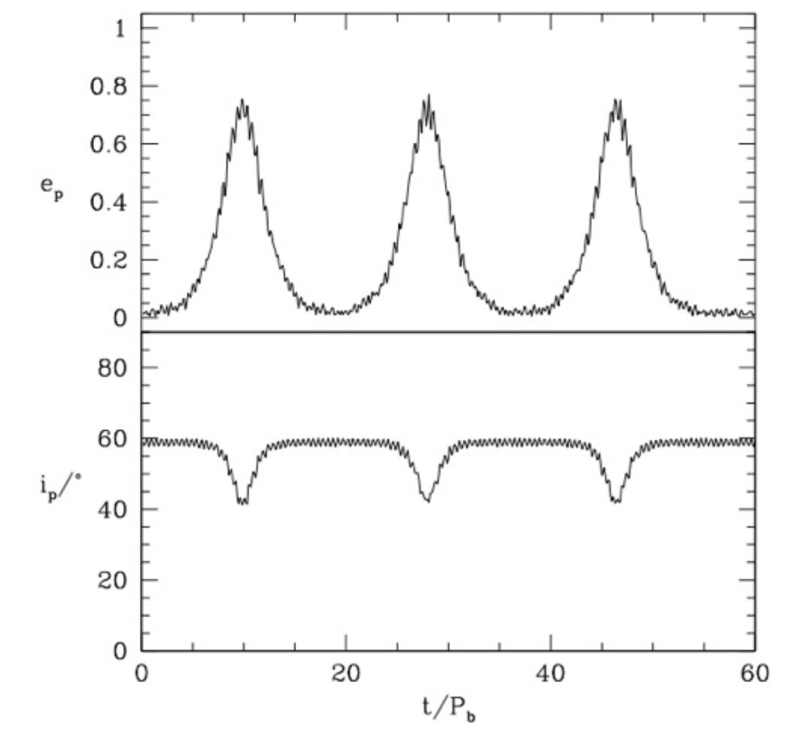

# Dynamics

1. What are the meanings of the true, eccentric, and mean anomalies?

	Anomaly is just an angle that sweeps from 0 to 2π in the span of an orbit. These are fast moving periodic variables the determine the position of an object in it's Keplerian Orbit. They each have different definitions but are all related to each-other via different equations and geometry. In 2D the classic elliptical orbit looks like 

	
	
	**True Anomaly:** 
	
	$$ f = \psi - \varpi$$

	$$\tan \left( \frac{f}{2} \right) = \sqrt{\frac{1 + e}{1 - e}} \tan \left( \frac{E}{2} \right) \; ,$$

	at periapsis $f = 0$, $\varpi$ is the longitude of periapsis.
	
	**Mean Anomaly:** 
	
	$$\ell = \frac{2 \pi}{P} (t - t_0) = n ( t - t_0 )$$

	**Eccentric Anomaly:** 
	
	$$ E - e \sin E = \ell $$ 

	$$ r = a(1 - e \cos E)$$

	It is important to draw this diagram in 3D as well. 
	
	
	
	To fully characterize an orbit one needs to describe the **shape of the orbit** most commonly with eccentricity and semi-major axis $(e, a)$, the **orientation of the orbit** most commonly with inclination, longitude of ascending node, and argument of periapsis $(I, \Omega, \omega)$, and the **phase of the orbit** given by one of the anomalies $(f, \ell, E)$. In total this is 6 orbital elements which makes sense since phase space has a dimensionality of 6. 

2. What is the Runge-Lenz vector and why is it important?

	The Runge-Lenz vector $\mathbf{e}$ is a conserved quantity in a Keplerian orbit. It's also commonly referred to as the "eccentricity" vector because it's magnitude is the eccentricity $e$ of the orbit. It can be written as 
	
	$$\mathbf{e} \equiv \frac{\mathbf{p} \times \mathbf{L}}{GMm^2} - \hat{\mathbf{r}}$$

	It always points parallel to the line of apsides (towards periapsis). Since this is a conserved quantity if it varies with time we have a non-Keplerian orbit which could be caused due to tidal effects or general relativistic effects as in the case of Mercury. One can get the shape of the orbit from it simply by 
	
	$$r = \frac{a(1 - e^2)}{1 + \mathbf{e} \cdot \hat{\mathbf{r}}} = \frac{a(1 - e^2)}{1 + e \cos f}$$

	To remember the RL vector, just remember the cross product of momentum and angular momentum minus r-hat. 
3. What is the mass function of a binary star system, and how is it determined?

	The binary mass function is probed using radial velocity measurements. The binary mass function is 
	
	$$ \mu \equiv \frac{m_1^3 \sin^3 I}{(m_0 + m_1)^2} = \frac{P}{2 \pi G} K^3 (1 - e^2)^{3/2}$$

	It is a combination of the masses of both the stars (or star and planet) and the inclination. This makes it particularly difficult to back out the mass of an exoplanet unless the system is edge on in which case $I = 0$. If there are 2 stars in the system then typically spectroscopic classification can get pretty good constraints on both the masses and thus the inclination can also be constrained. 

	$K$ represents the amplitude of the radial velocity curve and $K \propto a^{-1/2}$ which means this method is most sensitive to close-in planets. 

4. Describe as many methods for exoplanet detection as you can.

	* Transit Method
	* Radial Velocity Method
	* Astrometry
	* Timing Transit Variations (TTVs)
	* Direct Imaging
	* Gravitational Microlensing

	This figure from Yan-Fei's thesis is quite helpful for understanding the landscape of exoplanet observations. 
	
	
	
	There are of order ~6000 exoplanets discovered as of 2025, most of which have been discovered via the transit method through the Kepler and TESS missions. We anticipate many new discoveries through Astrometry with the upcoming GAIA data release. 

	Another note is that the transit method probes the dip in flux $F = 1 - R_p^2/ R^2_*$. To get a density of a planet one can do a radial velocity follow-up observation of a planet found with the Transit method to get a **minimum constraint** on the mass and thus a **lower bound on the density**.

5. What is the restricted three-body problem? Sketch some representative contours of the effective potential and describe the key features.

	A restricted version of the 3-body problem. The three conditions are 
	* I) $m_1$ and $m_2$ are in a nearly circular orbit around their barycenter (center of mass)

	* II) $m_1 \geq m_2 \gg m_3$ (mass hierarchy)

	* III) $m_3$ orbits in the orbital plane of $m_1$ & $m_2$. All motion in a single plane (coplanar).

	
	
	The black curves correspond to equipotential contours. We define the roots of the quintic equation of motion to be the Lagrange points. Simple analytical expressions only exist when $m_2 \ll m_1$. We note that $L_1, L_2,$ and $L_3$ are all in the line of apsides between $m_1$ and $m_2$. The solutions are 
	
	$$L_{1,2} = a \left[1 \mp \left(\frac{\alpha}{3}\right)^{1/3} \right]$$ 
	
	$$L_3 = -a \left[ 1 + \frac{5 \alpha}{12}\right]$$

	where the secondary mass fraction $\alpha = m_2 / (m_1 + m_2) \ll 1$ and these are with respect to the barycenter of $m_1$ and $m_2$. We note that the extra term in the equations of $L_1$ and $L_2$ is commonly referred to as the Hill Radius. The positions of $L_4$ and $L_5$ are given by equilateral triangles each with side length $a$. 

	A commonly referred to quantity in this context is the Jacobi Integral $C_J \equiv -v^2 - 2 \Phi_{\rm eff}$ which gives "zero-velocity curves" which are plotted in the contours above 
	
	$$C_{J,0} = -2 \Phi_{\rm eff} = \underbrace{\Omega^2 R^2}_{\rm centrifugal} + \underbrace{ 2 \mu \left( \frac{1 - \alpha}{r_1} + \frac{\alpha}{r_2} \right)}_{\rm Keplerian}$$

	Lastly, we note some commonly referenced phenomena. Horseshoe orbits correspond to when a body will orbit between $L_4$ and $L_5$ via $L_3$ back and forth reminiscent of a horseshoe shape. Additionally, the "Trojan" asteroids are colloquially referring to the asteroids that reside at $L_4$ and $L_5$ in the Sun-Jupiter restricted 3-body problem. The orbits of bodies there are also colloquially called "tadpole" orbits as they resemble tadpoles or rain drops. Solar probes are commonly placed at $L_1$ while observational astronomy satellites like Gaia, Planck, WMAP and JWST are all at $L_2$ because it is shielded from the solar wind by the Earth and it's one of the closest options. The Lagrange points in the line of apsides are unstable equilibria meaning that spacecraft require thrust adjustments to stay there while $L_4$ and $L_5$ are stable equilibria in the case of $\alpha \ll 1$. 
	
	
6. How much farther could the Moon be from the Earth while still being likely to remain bound?

	This can be estimated using the Hill Radius. In the circular orbit case 
				
	$$r_H = a \left(\frac{\alpha}{3}\right)^{1/3} = a \left(\frac{m_2}{3 (m_1 + m_2)}\right)^{1/3}$$

	if the orbit is eccentric, then this can be modified by multiplying a factor of $1 - e$ out front. The Hill sphere is the volume which a moon $m_3$ can remain stably bound to $m_2$ with perturbations from the primary $m_1$. A consequence of this is that a bigger Hill radius implies more satellites are likely to be had. This can roughly explain why Mercury has very little moons while Jupiter has many moons! The Hill radius of the earth is approximately $r_{H, \oplus} \approx 10 R_\odot \approx 4 d_{\rm moon}$ where $d_{\rm moon}$ is the distance between the Earth and the Moon. We could in theory move the moon 4x farther out and it would still remain bound. 
	
7. Give some examples of mean-motion resonance in the Solar System.

	Mean motion resonance is simply when two bodies orbiting the same primary have periods that can be expressed as a ratio of two small prime numbers. The term mean-motion resonance is just referring to the ratio of the mean motions $n = 2\pi / P$ being expressed as the ratio of small prime numbers (because dynamics loves jargon). 
	
	$$ \frac{n_2}{n_1} = \frac{a}{b}$$

	Some common examples in the solar system are **Pluto-Neptune which are roughly in a 3:2** resonance. The distribution of asteroids in the solar system tend to show troughs of presence commonly referred to as the **Kirkwood Gaps** 
	
	

	The "Hildas" asteroids around Jupiter are special and they follow a 3:2 mean-motion resonance (an abundance instead of a gap, not plotted) and they follow a cool triangular orbit pattern 
	
	

	Additionally we have mean-motion resonances in the moons of planets. **Jupiter has a Laplace resonance between Io, Europa, and Ganymede following a 4:2:1 ratio chain**. It is Laplace like because $n_1 > n_2 > n_3$, $n_1 / n_2 \approx n_2 / n_3$, and $(n_1 - n_2) / (n_2 - n_3) = a/b$. The final example in our solar system are the **moons of Pluto**: Styx, Nix, and Hydra in a 5:4 and 3:2 resonance respectively.

	Outside of our own solar system mean-motion resonances have been found. Most famous is the Trappist-1 system which has a resonance chain between all the planets. 

8. What is a symplectic integrator? How does it compare with other methods for long-term dynamical simulations?

	A numerical integration scheme which naturally preserves phase space and by extension **conserves the Hamiltonian**, this is ideal for simulating dynamical systems where the long term evolution is governed by the Hamiltonian. An attractive aspect of these schemes is that they are **time-reversible**. A 1st order symplectic scheme is the Symplectic Euler scheme and a 2nd order scheme is the Verlet scheme which belongs to the family of schemes commonly referred to as Leapfrog schemes. These schemes perform kick-drift-kick operations where they take a half step in velocity, update position, then fully update velocity. 

	The attractive properties of symplectic integrators are not givens in other common state-of-the-art schemes, for example RK4 is a 4th order scheme but it is not symplectic. For this reason, RK4 is susceptible to Energy Drift, harsher time-step constraints from stability criterion, or lack of time reversibility. 

	The state of the art in orbital integration is found in the code [REBOUND](https://rebound.readthedocs.io/en/latest/) where they use the IAS15 integrator (15th order) to handle close encounters (perturbations to $\mathcal{H}_K$) or collisions and a symplectic integrator otherwise. It switches between these two modalities adaptively and is thus highly attractive for realistic simulations of N-body systems where $N$ is not huge. 
	
9. What is the secular approximation in planetary dynamics?

	The secular approximation is when we **average over the fast changing variables** like mean, true, and eccentric anomaly to more easily describe **slow changing** variables like eccentricity, inclination, and argument of periapsis. 

	We do this by time-averaging the perturbing Hamiltonian over a single period of the fast variables while holding the slow variables fixed. For example let's consider an orbit of a test particle within the $xy$-plane where we add a perturbation scaled by $\epsilon \ll 1$ 
	
	$$\mathcal{H} = \mathcal{H}_K + \epsilon \mathcal{H}_1 \approx \mathcal{H}_K + \frac{\epsilon}{2\pi} \int_0^{2\pi} \mathcal{H}_1 d\ell = \mathcal{H}_K + \epsilon \langle \mathcal{H}_1\rangle_\ell$$

	We denote the secular Hamiltonian to be $\mathcal{H}_{\rm sec} = \langle \mathcal{H}_1\rangle_\ell$. If the secular Hamiltonian is independent of $\ell$ then from Hamilton's Equations using $\mathcal{H}_{\rm sec}$ it implies that $\dot{L} \approx 0$ and $\dot{a} \approx 0$ which means that the Keplerian semi-major axis is a constant of motion, this can be shown using a quadrupolar perturbation to the Keplerian orbit.

	If the Hamiltonian has an explicit time dependence but that time dependence is slow compared to one of the frequencies $\dot{\Theta}_k = cst. = \omega_k$, then the conjugate action $I_k$ is very nearly a constant of motion. In this case, $I_k$ is said to be **adiabatically invariant**. If this is confusing read question 13 which has some important information related to this comment. 

10. What are Kozai-Lidov oscillations? What are some astrophysical problems for which Kozai- Lidov oscillations might be part of the solution?

	The general setup of Kozai-Lidov oscillations is just that you have an inner binary ($m_1$ and $m_2$ where $m_1 > m_2$) with a perturbing outer tertiary object $m_3$ with some inclination $I$ relative to the inner binary. So long as the periapsis of $m_3$ is much greater than the semi-major axis of the inner binary, then Kozai-Lidov oscillations will likely happen. 

	The effect is the exchanging of eccentricity of the inner binary with inclination of the tertiary object. In this system the angular momentum in the $z$-direction $L_z$ is conserved. A conserved quantity here is commonly referred to as the Kozai Integral 
	
	$$f_z \equiv (1 - e_{\rm in}^2)^{1/2} \cos I$$

	As the inclination of $m_3$ relative to the orbital plane of $m_1$ and $m_2$ increases, the eccentricity of the inner binary's orbit decreases and vice versa. This can be seen in the figure below 
	
	

	Kozai-Lidov oscillations will occur when 
	
	$$f_z^2 = (1 - e_{\rm in}^2) \cos^2 I < \frac{3}{5} \; .$$

	if the **inner binary is circular, it will stay circular unless** 
	
	$$I > I_{\rm crit} = \cos^{-1} \left( \sqrt{\frac{3}{5}} \right) \approx 39^{\rm o} \; .$$ 
	
	The timescale for these oscillations is much longer than the period of the inner binary unless $m_3 \gg m_1 > m_2$. The timescale relative to the inner binary period is given by 
	
	$$\frac{\tau_{\rm KL}}{P_{\rm in}} \approx \frac{m_1}{m_3} \left(\frac{a_{\rm out}}{a_{\rm in}} \right)^3 (1 - e_{\rm out}^2)^{3/2}$$

	A characteristic example of this is shown below 
	

11. What is the Virial Theorem? How did Zwicky use this theorem to infer the existence of “dunkele Materie” (dark matter) in the Coma Cluster?

	The Virial theorem is a relation of the gravitational potential energy of a stellar system to the total kinetic energy. One can derive this in scalar form or in tensor form, they are the same you just add $ij$ subscripts to each term, we will stick to scalar form because that's what is practically useful. 

	The general Virial theorem is written as 
	
	$$\frac{1}{2} \ddot{I}^2 = 2K + W$$

	If we assume steady state such that $I = cst$, then this becomes 
	
	$$K = - \frac{1}{2}W \; .$$

	One can determine the mass of a system if they assume the system is virialized as in the case of the Coma cluster, in this case $\langle K \rangle \approx \frac{1}{2} M \sigma^2$ where $\sigma$ is the stellar velocity dispersion and $\langle W \rangle \approx -GM^2/R$ in which case the mass is simply 
	
	$$M \sim \frac{\sigma^2 R}{G}$$

	If one can measure the radius and the velocity dispersion of the cluster then one can back out a mass. When Fritz Zwicky did this he found that the velocity dispersion of stars/galaxies was far too large to account for with baryonic matter (stars and gas emitting light) and deduced that their must be some invisible "dark" matter. 

12. What distinguishes regular orbits from chaotic orbits?

	A **regular orbit** is one that is confined to a **torus in phase-space** and thus exhibits (quasi) periodic motion, this is stated by the KAM theorem. 

	In order for the KAM theorem to apply, there must be enough conserved quantities to confine motion to a **sub-manifold of phase space**. This also makes the system **integrable**. 

	Nearby trajectories remain close in phase-space over long timescales, the motion is also confined to a small number of fundamental frequencies. This can be seen in the **Poincaré Surface of Section** shown below 
	
	
	

	**Chaotic Orbits** are not integrable and they exhibit **exponential** sensitivity to the initial conditions characterized by the **Lyapunov Timescale** which can be written as 
	
	$$\delta(t) \approx e^{\lambda t} \delta_0$$

	characterized by the Lyapunov exponent factor $\lambda$ which is notoriously difficult to measure. For the Solar System this timescale is $t_L \sim 1/\lambda \sim 10 \; \rm Myr$. Which one might think would mean that the Solar System should be wildly chaotic but this is not true... why? 

	This is because the Lyapunov timescale is not the instability timescale. The nature of the chaotic behavior is different in the inner and outer solar system. 
	
	The **outer solar system chaotic behavior** is restricted to narrow regions in phase-space associated with high-order mean-motion resonances. As a result of this, the exponential divergence is limited to the orbital phase while the other elements (semi-major axis $a$ and eccentricity $e$) remain close to their initial values. 
	
	In the **inner solar system chaos** arises from the overlap of secular resonances and directly affects the eccentricities and inclinations of the planets. This means that the eccentricities and inclinations take a "random walk" through time as they are perturbed, this is strongest for Mercury but still happens for Venus, Earth, and Mars as seen below. It is impossible to predict the eccentricity of Mercury on $\sim \rm Gyr$ timescales. 
	
	

	In summary, **having a short Lyapunov time does not imply that the system will have a short instability time**. The reason for stability is that the Solar System possesses **“quasi-integrals of motion",** which are not exactly conserved, but remain approximately conserved over long ($\sim \rm Gyr$) timescales. It's the existence of quasi-conserved quantities that stops the chaotic evolution from dramatically altering the eccentricities or semi-major axes of the planets’ orbits. What’s worth knowing is that the Solar System is approximately secular, because the **planets are widely spaced and no planet pairs are near mean-motion resonances**, so the planets’ semi-major axes and the system’s total angular momentum deficit are approximately conserved.	

13. What are actions and angles, and what are they good for?
	
	In this question we will first do a general review of Hamiltonian & Lagrangian mechanics and then build up to answering the question. The governing quantities are either the Lagrangian or the Hamiltonian. The Lagrangian is given by 
	
	$$ \mathcal{L}(\mathbf{q}, \dot{\mathbf{q}}, t) = \mathcal{K}(\mathbf{q}, \dot{\mathbf{q}}, t) - \mathcal{V}(\mathbf{q}, \dot{\mathbf{q}}, t)$$

	where $\mathcal{K}$ is the kinetic energy and $\mathcal{V}$ is the potential energy if you will. The generalized momentum is given by 
	
	$$p_k \equiv \frac{\partial \mathcal{L}}{\partial \dot{q}_k} \; .$$

	The Euler-Lagrange Equations are given by 
	
	$$\frac{d}{dt} \left(\frac{\partial \mathcal{L}}{\partial \dot{q}_k} \right) - \frac{\partial \mathcal{L}}{\partial q_k} = 0 \;\;\;\;\; k \in \{ 1,2, ..., n \}$$

	If one is using a Lagrangian, those are the governing equations which will get you your answers. If you are doing Hamiltonian dynamics you will need the Hamiltonian defined as 
	
	$$ \mathcal{H}(\mathbf{q},\mathbf{p}, t) = \sum_k p_k \dot{q}_k - \mathcal{L}$$

	Or commonly written it is can simplify to $\mathcal{H}(\mathbf{q}, \mathbf{p}, t) = \mathcal{K}(\mathbf{q}, \mathbf{p}, t) + \mathcal{V}(\mathbf{q}, \mathbf{p}, t)$. Once we've defined a hamiltonian, we can write down Hamilton's equations 
	
	$$\dot{q}_k = \frac{\partial \mathcal{H}}{\partial p_k} \;\;\;\;\;\;\;\; \dot{p}_k = -\frac{\partial \mathcal{H}}{\partial q_k} \;\; .$$

	Before we can get to actions and angles, it would be a good idea for us to touch on the idea of a **constant of motion** which is any function of $\mathbf{q}$ and $\dot{\mathbf{q}}$ that is independent of time along all trajectories allowed by the equations of motion. A beautiful aspect of Lagrangian and Hamiltonian mechanics is that it facilitates finding constants of motion $I_k$ where $\partial I_k / \partial t = 0$. 

	**Noether's Theorem** states that whenever the Lagrangian is independent of a specific coordinate $q_k$ (i.e $\partial \mathcal{L} / \partial q_k = 0$), this coordinate is **cyclic**, and the conjugate momentum $p_k = \partial \mathcal{L} / \partial \dot{q}_k$ is a constant of motion. This is very important, one can see this by plugging in a cyclic coordinate into the Euler-Lagrange equations 

	$$ \frac{\partial \mathcal{L}}{\partial q_k} = 0 $$ 
	
	$$ \frac{d}{dt} \left(\frac{\partial \mathcal{L}}{\partial \dot{q}_k} \right) - \frac{\partial \mathcal{L}}{\partial q_k} = \frac{d}{dt}(p_k) = 0 \rightarrow p_k = I_k \; .$$
	
	Now we are equipped to understand actions and angles in the context of orbital mechanics. 

	If we suppose that the Hamiltonian is time-independent as in the case of the Keplerian Hamiltonian $\mathcal{H}_K$, and that the system has $n$ degrees of freedom, then there exists $n$ independent constants of motion $I_1, ..., I_n$ each with dimensions of action (energy $\cdot$ time, like $\hbar$). These constants of motion have Poisson brackets that vanish with each other $\{I_j, I_k\} = 0$, but wait... what's a Poisson Bracket? It's just defined as an operator between two functions $F(\mathbf{q}, \mathbf{p})$ and $G(\mathbf{q}, \mathbf{p})$ 
	
	$$\{F,G\} \equiv \sum_i \left(\frac{\partial F}{\partial q_i}\frac{\partial G}{\partial p_i} - \frac{\partial G}{\partial q_i}\frac{\partial F}{\partial p_i} \right) \; .$$

	If we go back to the statement that the constants of motion satisfy $\{I_j, I_k\} = 0$, we can say that each constant of motion is a definite function of $(\mathbf{q}, \mathbf{p})$, but not explicitly dependent on time. We can suppose further that we can find a **canonical transformation** such that the new momenta are these constants of motion (i.e $p_k \rightarrow p_k' = I_k$). We note that a canonical transformation is just a transformation to some new coordinates $\mathbf{q}'$ and momenta $\mathbf{p}'$ which are functions of the original coordinates and momenta $(\mathbf{q}, \mathbf{p})$ and maintain that $(\mathbf{q}', \mathbf{p}')$ and $(\mathbf{q}, \mathbf{p})$ are **canonically conjugate** throughout meaning the following conditions are and remain satisfied

	$$\{ q_j, q_k \} = 0 \;\;\;\;\;\; \{ p_j, p_k \} = 0 \;\;\;\;\;\; \{ q_j, p_k \} = \delta_{jk} \; .$$

	Given that we can find this canonical transformation such that the new momenta are the constants of motion, then we expect that the coordinate conjugate to $p_k' = I_k$ denoted as $q_k'$ should be dimensionless since $p_k q_k$ has units of action. Since these new coordinates are dimensionless, we call them the **angles** denoted as $q_k' = \Theta_k$ and we call $p_k' = I_k$ the **actions**, together $(\Theta_k, I_k)$ are denoted as **action-angle variables**. 

	Since $I_k$ is a constant of motion, and since **canonical transformations preserve Hamilton's Equations and phase-space areas** , we can write 

	$$ \dot{I}_k = \{ I_k, \mathcal{H} \} = -\frac{\partial \mathcal{H}}{\partial \Theta_k} = \frac{\partial \mathcal{L}}{\partial \Theta_k} = 0 $$

	This is an important result because it means all coordinates $\Theta_k$ are cyclic and $\mathcal{H} = \mathcal{H}(\mathbf{I})$ - in other words the **Hamiltonian is not dependent on the angles (coordinates) $\Theta_k$, only the actions $I_k$**. This is very powerful. 

	The details of how one finds these action-angle variables is above the scope of this document, for that you should read [Tremaine](https://press.princeton.edu/books/paperback/9780691207117/dynamics-of-planetary-systems?srsltid=AfmBOooBO_Mtg6bVMronJmxfQ6ZUSbtCm-Dc9LDyAnF2C_29uBTfB90H). What is important though, is knowing a few canonical transformations commonly used in orbital mechanics and understanding how these general concepts fit into this picture. Broadly, these action-angle variables can **simplify the equations of motion**. 

	**The Delauney Variables** are a set of action-angle variables which simplify the Keplerian equations of motion. 

	$$\ell \leftrightarrow \Lambda = \sqrt{GMa}$$

	$$ \omega \leftrightarrow L = \Lambda \sqrt{( 1 -e^2)}$$

	$$\Omega \leftrightarrow L_z = L \cos I$$

	and according to our results, then we can write the Hamiltonian as 

	$$ \mathcal{H}_K = \frac{\mathbf{v}^2}{2} - \frac{GM}{r} = -\frac{1}{2}\left( \frac{GM}{ \Lambda}\right)^2 $$
	
	which is independent of the angles and depends only on the actions (we divide by mass here). In these coordinates, fundamental frequencies can reveal mean-motion resonances and secular evolution effects via Lagrange-Laplace secular theory.

14. What is the collisionless Boltzmann equation, and to what extent does it apply to stellar systems?

	The distribution function $f(\mathbf{r}, \dot{\mathbf{v}}, t)$ is crucial to understanding many body systems in dynamics. The distribution function is a 6-dimensional phase-space number density of particles (just like in quantum mechanics and statistical mechanics) but in astrophysics we can treat stars as particles since the probability of two stars colliding is so small in the vastness of space.

	With a distribution function, one has limitless power because several quantities can be obtained from integrating the distribution function 
	
	$$n_*(\mathbf{r}, t) = \int f(\mathbf{r}, \dot{\mathbf{v}}, t) \; d^3 \mathbf{v}$$ 
	
	$$\rho_*(\mathbf{r}, t) = \int \underbrace{\langle m_* \rangle f(\mathbf{r}, \dot{\mathbf{v}}, t)}_{f_m} \; d^3 \mathbf{v}$$

	$$\Psi_*(\mathbf{r}, t) = \int \underbrace{\langle L_* \rangle f(\mathbf{r}, \dot{\mathbf{v}}, t)}_{f_L} \; d^3 \mathbf{v}$$ 
	
	$$\mathbf{u}(\mathbf{r}, t) = \int \mathbf{v} f(\mathbf{r}, \dot{\mathbf{v}}, t) \; d^3 \mathbf{v}$$

	$$\langle v_i v_j \rangle = \int v_i v_j f(\mathbf{r}, \dot{\mathbf{v}}, t) \; d^3 \mathbf{v} \;\;\; \rightarrow \;\;\; \sigma_{ij}^2 = \langle v_i v_j \rangle - u_i u_j$$
	
	As shown integrating over velocity space with various weightings can give number, mass, luminosity densities, bulk velocities, and velocity dispersions. 

	The "Fundamental Equation of Stellar Dynamics" is commonly referred to as the **Collisionless Boltzmann Equation** which is essentially just a continuity equation for the distribution function 
	
	$$\frac{\partial f}{\partial t} + \mathbf{v} \cdot \nabla f - \nabla \Phi \cdot \frac{\partial f}{\partial \mathbf{v}} = 0$$

	What distinguishes this from the **Collisional Boltzmann Equation** is the right hand side equalling 0. If the RHS of the equation is non-zero that can account for various deviations from collisionless like kicks, stellar mergers, supernovae, or stellar births which all act as sources and sinks to this equation. One can be real fancy if they so choose and write this equation in the form of a **Poisson Bracket** 
	
	$$\dot{f} + \{ f, \mathcal{H} \} = 0 = \frac{Df}{Dt}$$

	The assumption when writing down this CBE is that gravity is the only force acting on these particles $\dot{v}_i = - \partial \Phi / \partial r_i$, that $\mathbf{r}$ and $\mathbf{v}$ are independent of each-other, and $\Phi$ is independent of $\mathbf{v}$. 

	The assumption of **Collisionless** applies when we can **neglect kicks from close encounters**, for example this **applies in the solar system ✅** but **does not apply in globular clusters 🚫**. If this were applicable for globular clusters then we would expect gravothermal catastrophe which the collisional terms added to the RHS will counteract to prevent collapse. 

	When a system is collisionless, we can use the "smooth" approximation which allows us to apply Poisson's equation for example 
	
	$$\nabla^2 \Phi = 4 \pi G \rho(\mathbf{r}) \; .$$

	Another cool application of the Collisionless Boltzmann Equation is to integrate the moments of the CBE to derive **Jean's equations**. We start by deriving the mass continuity equation

	$$\int \left[\frac{\partial f}{\partial t} + \mathbf{v} \cdot \nabla f - \nabla \Phi \cdot \frac{\partial f}{\partial \mathbf{v}} \right] \; d^3 \mathbf{v} = 0 \;\;\; \longrightarrow \;\;\; \frac{\partial n_*}{\partial t} + \nabla \cdot (n_* \mathbf{u}) = 0 \; ,$$

	and then we can derive the momentum conservation equation 
	
	$$\int v_i\left[\frac{\partial f}{\partial t} + \mathbf{v} \cdot \nabla f - \nabla \Phi \cdot \frac{\partial f}{\partial \mathbf{v}} \right] \; d^3 \mathbf{v} = 0 \;\;\; \longrightarrow \;\;\; \frac{\partial (n_* \mathbf{u})}{\partial t} + \nabla \cdot (n_* \mathbf{v} \otimes \mathbf{v}) = -n_* \nabla \Phi \; .$$

	We note that $\mathbf{v} \otimes \mathbf{v} = \langle v_i v_j \rangle$ and we restate that $\sigma_{ij}^2 = \langle v_i v_j \rangle - u_i u_j$. We also note this equation does not have a pressure term like one would see in fluid dynamics. The mass continuity equation and the momentum equation(s) (3 equations, one for each dimension $j = 1,2,3$) are together the **Jeans' Equations** which have many more unknowns than equations.  They are only solvable when we make some simplifying assumptions. One can combine these two equations to get an equation of motion 

	$$\frac{\partial u_j}{\partial t} + \sum_i u_i \frac{\partial u_j}{\partial r_i} = -\frac{\partial \Phi}{\partial r_j} - \frac{1}{n_*} \sum_i \frac{\partial (n_* \sigma_{ij}^2)}{\partial r_i} \; .$$

	These equations are particularly useful when we assume steady state in either an axisymmetric stellar disk or a spherically symmetric potential like a globular cluster for example. An a stellar disk in a spiral disk galaxy is approximately an axisymmetric stellar disk. If we use cylindrical coordinates $(R, z, \theta)$ and assume an axisymmetric system then $u_R = u_z = 0$ and we get the **steady-state axisymmetric jeans equations**

	$$\frac{1}{R} \frac{\partial}{\partial R} \left( R n_* \sigma_{RR}^2 \right) + \frac{\partial}{\partial z} (n_* \sigma^2_{Rz}) - n_* \frac{\sigma_{\theta \theta}^2 + u_\theta^2}{R} = -n_* \frac{\partial \Phi}{\partial R}$$

	$$\frac{1}{R^2} \frac{1}{\partial R} (R^2 n_* \sigma_{R\theta}^2) + \frac{\partial}{\partial z}(n_* \sigma_{z\theta}^2) = 0$$ 
	
	$$\frac{1}{R} \frac{\partial}{\partial R} \left( R n_* \sigma_{Rz}^2 \right) + \frac{\partial}{\partial z}(n_* \sigma_{zz}^2) = -n_* \frac{\partial \Phi}{\partial z} \; .$$
	

	If we assume **spherical symmetry and steady state** with no net rotation such that $u_r = u_\theta = u_\phi = 0$ and all cross terms in the velocity dispersion tensor are 0 and lastly that $\sigma_{\theta \theta} = \theta_{\phi \phi} = \sigma_t$ we arrive at 
	
	$$\frac{d(n_* \sigma_r^2)}{dr} + \frac{2 n_*}{r}(\sigma_{rr}^2 - \sigma_t^2) = - n_* \frac{d\Phi}{dr} \; .$$
	 
	It is common to define an **anisotropy parameter** 
	
	$$\beta(r) \equiv 1 - \frac{\sigma_{\theta \theta}^2 + \sigma_{\phi \phi}^2}{2 \sigma_{rr}^2} = 1 - \frac{\sigma_t^2}{\sigma_r^2} \; ,$$

	where we expect spherical systems with ~ radial orbits to have $\beta \approx 1$, purely circular orbits will have $\beta \approx -\infty$, and perfect isotropy will yield $\beta \approx 0$. Which allows us to write this equation as the reduced **Spherical Jeans Equation** which is written as 
	
	$$\frac{d(n_* \sigma_r^2)}{dr} + 2 \beta \frac{n_* \sigma_r^2}{r} = - n_* \frac{d\Phi}{dr} \; .$$

	If perfectly isotropic $\beta = 0$ then this is a statement of hydrostatic equilibrium like we see in stellar interiors.
	
 	
14. Perform an order-of-magnitude calculation of the timescale for two-body relaxation by stellar encounters in the solar neighborhood. What about in a typical globular cluster?

	The two-body relaxation time is roughly the timescale for a close gravitational encounter (CGE) $t_{\rm rel} \sim t_{\rm cge}$. The close encounter timescale is the timescale for an interaction to occur where a star will be deflected in its trajectory by $\theta \geq 90^{\rm o}$. This can be approximated using kinetic theory where we define the mean-free path $\lambda_{\rm mfp} = (n_* \sigma_{\rm cge})^{-1}$ and the timescale of a CGE can be estimated as $t_{\rm cge} \approx \lambda_{\rm mfp} / v$ where $v$ is the typical velocity of a star. The question becomes, what is $\sigma_{\rm cge}$? Well the CGE cross section can be written as $\sigma_{\rm cge} = \pi b^2_{\rm cge}$, where we define 
	
	$$b_{\rm cge} = \frac{2 G \langle m_* \rangle}{v^2} \; ,$$

	This definition comes from the condition of deflection which comes from hyperbolic orbit 
	
	$$ \Delta \theta = \pi - 2 \cos^{-1}\left( \frac{1}{e} \right) = 2 \sin^{-1} \left( \frac{1}{e} \right) \;\;\; \longrightarrow \;\;\; e_{\rm crit} = \sqrt{2} $$

	Combining all of this we find the 2-body relaxation time to be 
	
	$$t_{\rm rel} \sim t_{\rm cge} \approx \frac{v^3}{4 \pi n_* (G \langle m_* \rangle)^2} \approx 10^6 \; \mathrm{Gyr} \left(\frac{v}{30 \; \rm km/s}\right)^{3} \left(\frac{n_*}{0.2 \; \rm pc^{-3}}\right)^{-1} \left(\frac{m_*}{M_\odot}\right)^{-2} \;.$$

	In the **solar neighborhood** we find $t_{\rm rel} \sim 10^6 \; \rm Gyr \gg t_{\rm sys}$ where $t_{\rm sys}$ is the age of the system (values used for solar neighborhood are in the equation above). This means the timescale for a CGE is much longer than the age of the solar system and the universe so it is unlikely that a CGE has happened to our Sun. Meanwhile, in a **Globular Cluster** though $n_* \sim 10^3 \; \rm pc^{-3}$ and $v \sim 10 \; \rm km/s$ which gives a relaxation time of $t_{\rm rel} \sim 4 \; \rm Gyr$. 

	A system is collisionless if $t_{\rm rel} > t_{\rm sys}$ and it is collisional if $t_{\rm rel} < t_{\rm sys}$. There are no physical collisions, just lots of close encounters inducing kicks.

	An important form that people commonly use for the relaxation time is 
	
	$$t_{\rm rel} \sim 0.1 \frac{N}{\ln N} t_{\rm dyn}$$

	where $N$ is the number of stars in the system and $t_{\rm dyn} = (G \rho)^{-1/2}$ is the dynamical time.  This is computed accounting for close and distant encounters and the factor of $\ln N$ comes from the the $\ln \Lambda$ coefficient seen in dynamical friction. A proper derivation of this form requires a bit more thought and one should refer to [Tremaine](https://press.princeton.edu/books/paperback/9780691207117/dynamics-of-planetary-systems?srsltid=AfmBOooBO_Mtg6bVMronJmxfQ6ZUSbtCm-Dc9LDyAnF2C_29uBTfB90H) for a comprehensive treatment of this.

15. What is dynamical friction? If the space density of stars is n and their velocity dispersion is σ, sketch and explain the dependence of the effective frictional force on v.

	Dynamical friction is the momentum loss due to gravitational interactions. The easiest way to think about it is to look at the figure below 
	
	
	
	where we have a massive body $M$ moving through a medium of stars with mass $m$. As the massive body moves through the medium it will create a gravitational wake that will produce an over-density behind the massive body which will exert a gravitational pull on the massive body. 

	The **Chandrasekhar Formula** is the general formula for this effect written as 
	
	$$\frac{d \mathbf{v}}{dt} = -16 \pi^2 \ln \Lambda G^2 (M + m)m \left[\int_0^{v_M} v^2 f(v) dv \right] \frac{\mathbf{v_M}}{v^3_M}$$

	where $v_M$ is the velocity of the massive body. This formula will simplify in two limits. 

	If **$v_M$ is small relative to $\sigma$** then we expect $f(v) \rightarrow f(0)$ in the integral which means that we get $F_d \propto v_M$ which behaves like Stokes' Drag. This is akin to a ball moving through honey. 

	If **$v_M$ is large relative to $\sigma$** then we expect the integral to converge to $n/4\pi$ which gives $F_d \propto v_M^{-2}$. 

	

	Dynamical friction can serve as a mechanism to move stars toward equipartition in kinetic energy. Dynamical friction is typically important in the decay of BH orbits (final parsec problem), galactic canabalism, bars in a spiral galaxy, formation and evolution of binary black holes, and globular clusters. 

	The simplified form that is commonly used is
	
	$$F_d \sim C \left[\frac{G^2 M^2 \rho}{v_M^2} \right]$$

	where $C$ is a factor that depends on $X = v_M / \sqrt{2} \sigma$ and goes from 0 to 1 as $X$ increases. One can write $C$ explicitly as
	
	$$C = 4 \pi \ln \Lambda \left[ \mathrm{erf}(X) - \frac{2X}{\sqrt{\pi}}e^{-X^2}\right] \; .$$
	

16. What is the distance between the Sun and the center of the Milky Way? How do we know?

	The distance between the Sun and the center of the Milky Way is $d \sim 8 \; \rm kpc$. This is determined from high resolution spectroscopy and astronomy of stars around the galactic center and Sgr A* (the SMBH at the galactic center). These observations are typically done in the IR to get around optical dust extinction. Once the orbital parameters are inferred, one can back out the physical semi-major axis of the orbit $a_{\rm orbit}$, and then we can compare proper motions on the sky of the stars in that orbit to get a geometric distance measurement which tells us the distance between our Sun and the galactic center. 

	
	

17. What is the Lin-Shu dispersion relation for tightly wound spiral galaxies?

	The Lin-Shu dispersion relation for a razor thin fluid disk is written as 
	
	$$(\omega - m\Omega)^2 = \kappa^2 - 2 \pi G \Sigma |k| + c_s^2 k^2$$

	where the RHS represents gravitational collapse of the fluid and the right-most term is effectively fluid pressure balance. The epicyclic frequency $\kappa$ is given by 
	
	$$\kappa \equiv \sqrt{R \frac{\partial (\Omega^2)}{\partial R} + 4 \Omega}$$

	and $m$ represents the number of spiral arms. For a stellar disk we have something similar 
	
	$$(\omega - m\Omega)^2 = \kappa^2 - 2 \pi G \Sigma |k| \mathcal{F}$$

	where $\mathcal{F}$ is the reduction factor which is less than one. 

18. Describe the streams of stars that are observed in the halo of the Milky Way. Why are they interesting?

	Stellar streams are thought to be tidally disrupted satellite dwarf galaxies or globular clusters which have been shredded or ripped apart dynamically from interacting with the Milky Way or other galaxies. 
	
	They are particularly interesting because they can be used to constrain the galactic potential which can then be used to study the density profile of the dark matter halo of the Milky Way galaxy and test theories of dark matter. There has been a lot of work done to infer the distribution function of stars from stellar streams as well. They encode merger history and they preserve homogeneous stellar populations from their progenitor dwarf galaxy or globular cluster. One can then infer a chemical evolution history of the MW and can constrain timescales for enrichment processes this way. 

	The **Sagittarius Stream** was the first stellar stream to be observed and is the result of a merging between MW and Sagittarius Dwarf galaxy, but since then 10s of streams have been identified (largely by the [S5 Collaboration](https://s5collab.github.io)). Famous streams include Arcturus, Magellanic, Sagittarius and they have a characteristic mass of $M \sim 10^8 \; \rm M_\odot$ and length of $L \sim 100 \; \rm kpc$. 

	

19. Sketch the rotation curve of a typical L-star spiral galaxy. Explain how it is measured, and how to relate the rotation curve to the mass distribution.

	
	
	The rotation curve for an $L_*$ galaxy like the Milky Way is roughly solid body at small scales and flat at large scales. The Sun is approximately 8 kpc away from the center of the Milky Way and moving at $\sim 230 \; \rm km/s$ which gives the approximate velocity of the flat part of the rotation curve depicted above. 

	In the Solar Neighborhood and within we constrain the rotation curve of the Milky Way galaxy using the Oort Constants which can be written as 
	
	$$A = \frac{1}{2} \left( \frac{V_0}{R_0} - \left. \frac{dv}{dr} \right|_{R_0} \right)$$

	$$B = -\frac{1}{2} \left( \frac{V_0}{R_0} + \left. \frac{dv}{dr} \right|_{R_0} \right)$$

	where $V_0 = 230 \; \rm km/s$ is the tangential velocity of the Sun in the MW and $R_0 = 8 \; \rm kpc$ is the radius of the Sun relative to the center of the disk. The constants represent the local shearing motion $A$ and the local vorticity (angular momentum gradient) $B$. These constants will change depending on the velocity profile of the galaxy. 
	
	To understand what these Oort Constants mean we need to draw a diagram

	

	We denote $l$ to be the galactic longitude, $d$ to be the distance to the star, and $R$ to be the distance to the galactic center from the star moving at velocity $V$. According to the observer (viewing from the Sun), the velocity of the star will have an observed radial and tangential component which can be written as 
	
	$$V_{\rm obs,r} = V_{\rm star, r} - V_{\rm sun, r} = V \cos(\alpha) - V_0 \sin(l)$$ 
	
	$$V_{\rm obs,t} = V_{\rm star, t} - V_{\rm sun, t} = V \sin(\alpha) - V_0 \cos(l)$$

	with a bit of geometry, a Taylor expansion, some half angle formulae, and knowing that $v = \Omega r$, one can derive that 
	
	$$V_{\rm obs, r} = A \cdot d \cdot \sin(2 l)$$ 
	
	$$V_{\rm obs,t} = A \cdot d \cdot \cos(2l) + B \cdot d$$

	where $A$ and $B$ are the constants we wrote at the beginning of this question. For a clear derivation of the constants we refer to [Wikipedia](https://en.wikipedia.org/wiki/Oort_constants). What is important is that these constants can be constrained observationally using astrometry from surveys like GAIA or Hipparcos using the following formula 

	$$A = \frac{V_{\rm obs, r}}{d\cdot \sin(2l)}$$ 
	
	$$B = \frac{V_{\rm obs, t}}{d} - A \cos(2l)$$
	
	which depend on observable quantities, granted they are difficult to measure. The radial velocity component for stars usually can be measured using Doppler redshifts of stellar absorption features like the Ca[II] Triplet for example. One can also measure positions and velocities of photoionized gas via line emission (H$\alpha$ or O[II]). According to [GAIA DR1](https://arxiv.org/pdf/1610.07610) it has been measured that $A = 15.3 \pm 0.4 \; \rm km/s/kpc$ and $B = -11.9 \pm 0.4 \; \rm km/s/kpc$.  This is consistent with **Differential Rotation** which is crucial evidence for the flat rotation curve of the Milky Way. These measurements required $\sim 300,000$ stars from the GAIA DR1 astrometry catalog. 

	

	What do $A$ and $B$ look like for different types of rotation? 
	
	Well if we have **solid body rotation** then $\Omega = \rm cst.$ so that $v = \Omega r$ which means 
	
	$$A = 0 \;\;\;\;\;\;\; B = -\Omega_0$$

	which is inconsistent with the local neighborhood measurements. 

	If we have **Keplerian rotation** then 
	
	$$v = \sqrt{\frac{GM}{r}}$$

	so that 
	
	$$A = \frac{3 V_0}{4 R_0} \;\;\;\;\;\;\; B = -\frac{V_0}{4R_0} $$

	which for the values of the Sun give $A = 20 \; \rm km/s/kpc$ and $B = -7 \; \rm km/s/kpc$ which are a bit off from the observations. 

	Lastly if we have a **flat rotation curve** then $dv/dr = 0$ and we expect that 
	
	$$A = \frac{V_0}{2 R_0} \;\;\;\;\;\;\; B = -\frac{V_0}{2R_0}$$

	which gives predictions that $A = 13.6 \; \rm km/s/kpc$ and $B = -13.6 \; \rm km/s/kpc$ and thus this best matches the measurements for Oort constants measured by GAIA DR1. This is referred to as **Differential Rotation**.

	Lastly, this seems a bit circular but one can measure $V_0$ using the Oort constants via $V_0 = R_0(A - B)$ which depends on a measurement of $R_0$ which we can get via measurements of Sgr A*. The mass density profile can also be measured by 
	
	$$\rho(R) = \frac{B^2 - A^2}{2 \pi G}$$

	One can also constrain the epicyclic frequency $\kappa$ by $\kappa^2 = - 4 B \Omega$. 

	The rotation curve can be probed in other regions than just around our local neighborhood. A commonly used method is with 21-cm observations of HI which can probe the rotation curve in the outer regions of the galaxy. This is because the gas disk extends much farther than the stellar disk. 

	The rotation curve is related to the Mass Profile by Newton's law or energy conservation
	
	$$\frac{GM(r)}{r^2} = \frac{v^2(r)}{r} \;\;\; \longrightarrow \;\;\; M(r) = \frac{r v^2(r)}{G} \; .$$

	A slight aside, but an important thing to note about potentials relating to velocity curves. If we assume spherically symmetric potential, then the potential that achieves a flat rotation curve is the **isothermal sphere** potential, in this case $\Phi(r) \propto -\ln(r)$. If we assume an axisymmetric potential then the surface density profile that gives you a flat rotation curve is the **Mestel Disk** where $\Sigma(R) = \Sigma_0 (R_0 / R)$. The Mestel speed is equal to the circular motion speed if the Mestel disk is infinite. Another useful surface density profile is the **Exponential Disk** where $\Sigma(R) = \Sigma_0 \exp(-R/R_0)$. Lastly, when people refer to a thin disk we often use $\rho(z) = \rho_0 \; \mathrm{sech}^2(z/ 2 H_z)$ where $H_z$ is the scale height of the disk which is assumed to be $H_z \ll R_0$. 

20. What is the Toomre Q parameter, and why is it useful?

	The Toomre Q parameter is a parameter for stability within the Lin-Shu dispersion relation. The Toomre Q parameter is written as 
	
	$$Q \equiv \frac{\kappa c_s}{\pi G \Sigma}$$
	The disk is stable if $Q > 1$ and unstable if $Q < 1$. If $Q \ll 1$ then this would indicate a high star formation rate within the disk. For a stellar disk one just replaces the sound speed with the stellar velocity dispersion $\sigma_V$. There should be a pre-factor out front but it's of order unity. 

	It is useful because 
	* $Q \ll 1$ implies high SFR
	* spirals tend to form in marginally stable disks $Q \sim 1$. If $Q$ is too low then the disk will fragment into smaller structures rather than forming a coherent spiral. 
	
	$$Q < 1 \;\;\; \longrightarrow \;\;\; \lambda < \frac{4 \pi^2 G \Sigma}{\kappa^2} = \lambda_{\rm crit}$$

	* can be used to determine the formation of the galactic bar.

21. What is the Oort limit and how is it determined?

	The Oort limit is a constraint on the total mass density in the solar neighborhood from the motions and number of stars in the solar neighborhood. Jan Oort determined this constraint originally using Jeans' equations, we will walk through this briefly. 

	To start we will use the steady-state axisymmetric Jeans' equation in the $z$-direction (see Question 14) 
	
	$$\underbrace{\frac{1}{R} \frac{\partial}{\partial R} \left( R n_* \sigma_{Rz}^2 \right)}_{\rm ignore \; b/c \; small} + \frac{\partial}{\partial z}(n_* \sigma_{zz}^2) = -n_* \frac{\partial \Phi}{\partial z} \; .$$ 

	Then we can write down the Poisson Equation in cylindrical coordinates 
	
	$$4 \pi G \rho = \underbrace{\frac{1}{R} \frac{\partial}{\partial R} \left( R \frac{\partial \Phi}{\partial R} \right)}_{= \; 0} + \frac{\partial^2 \Phi}{\partial z^2} \; ,$$

	where we can ignore the first term on the RHS because we expect that $v(R) \sim \rm cst.$ Combining the two equations we can write 

	$$4\pi G \rho = -\frac{\partial}{\partial z} \left[\frac{1}{n_*(z)} \frac{\partial(n_*(z) \sigma_z^2(z))}{\partial z} \right] \; .$$

	We can see from this form that one can constrain the total matter density $\rho$ if they can measure the number density of stars at a given height $z$ and the velocity dispersion of stars at the same height $z$. This is what Jan Oort originally tried to do to look for the existence of dark matter and he found that there was not significant evidence for dark matter in the solar neighborhood. This method is challenging because it requires measuring the velocity dispersion of stars at a given height $z$ which will impart a lot of noise!
	
	Subsequent work was done with Hipparcos to show that **most of the matter in the solar neighborhood is from the stellar component and is not dark matter dominated**. In practice, the form written above is not what is actually done. Instead the distribution function is used to relate the number density to the potential 

	$$n_*(z) \propto \int_0^\infty dv_z f([v_z^2/2 + (\Phi - \Phi_0)] + \Phi_0) \propto (\Phi - \Phi_0)$$

	which has the benefit of allowing one to use $z$-component velocities of all stars (commonly A and F stars are used) in the solar neighborhood regardless of height $z$ combined with star counts $n_*(z)$ which one can then use to constrain $\Phi$ and thus back out $\rho$ with Poisson's equation rather than using Jeans' equation. For more details see Chapter 4 of [Binney & Tremaine](https://press.princeton.edu/books/paperback/9780691130279/galactic-dynamics?srsltid=AfmBOooofkLZVq8qKCIhNGFK-w60VlruklGcOFyhVyeB7_oEuRimsebk). The data suggests $\Phi - \Phi_0 = \frac{1}{2} k z^2$ where $k$ is fit to the observations via least squares. If the potential takes on this form then the density is directly inferred from $k$ by $\rho_0 = k / 4 \pi G$.

	The values to remember from this are $\rho_0 \approx 0.1 \; \rm M_\odot / pc^3$ and the surface mass density $\Sigma = \int dz \; \rho(z)$ is approximately $\Sigma(R_0) \approx 70 \; \rm M_\odot pc^{-2}$ (up to scale height of $z = 1.1 \; \rm kpc$).  This is large compared to what is expected from the dark matter halo which we assume to be spherical and have circular speed that is constant

	$$\rho_{\rm halo} = \frac{1}{4\pi r^2} \frac{dM}{dr} = \frac{v_0^2}{4 \pi G r^2} = 0.014 \; \mathrm{M_\odot \; pc^{-3}} \left(\frac{v_0}{200 \; \rm km/s} \right)^2 \left( \frac{R_0}{8 \; \rm kpc} \right)^{-2} \; .$$

	so we find $\rho_0 \sim 10 \rho_{\rm halo}$ which means that dark matter is subdominant in the local neighborhood compared to the mass of stars! 
	
22. What is the gravothermal catastrophe? 

	An instability in self-gravitating systems. This occurs during secular evolution of density and internal energy. 

	This was a concern in stellar systems like globular clusters where it was expected that their cores would collapse. This is expected because we would expect a **negative specific heat effect which means dynamical temperature increases as energy decreases**. This is primarily observed in gravitationally bound systems. We can look to the virial theorem to explain: $K = -U/2$ which means $U$ goes down as $K$ goes up (gets more dynamically hot). This can negative specific heat effect can also be found in Hawking radiation around Black Holes and the cores of stars when they contract. 
	
	One would expect that it would collapse without bound, but this effect can be halted by the formation of **binary star systems**. This acts as a **latent heat source** which **cools the core** until $\nabla T$ declines to 0. Instead of fully collapsing, the system undergoes gravothermal oscillations (contractions). 
	
	This doesn't apply to CDM because it's collisionless and non-self interacting. If we had self-interacting DM then we would expect super dense DM cores. 
