# Stars

1. Draw a Hertzsprung-Russell diagram with luminosity and temperature axes, and then:
	• Identify the main sequence, with representative stellar masses labeled.
	• Draw a few lines of constant radius.
	• Use the diagram to describe the evolution of a solar-mass star.
	• Identify the white-dwarf cooling sequence.
	• Explain how such a diagram is used to estimate the age of a globular cluster.

	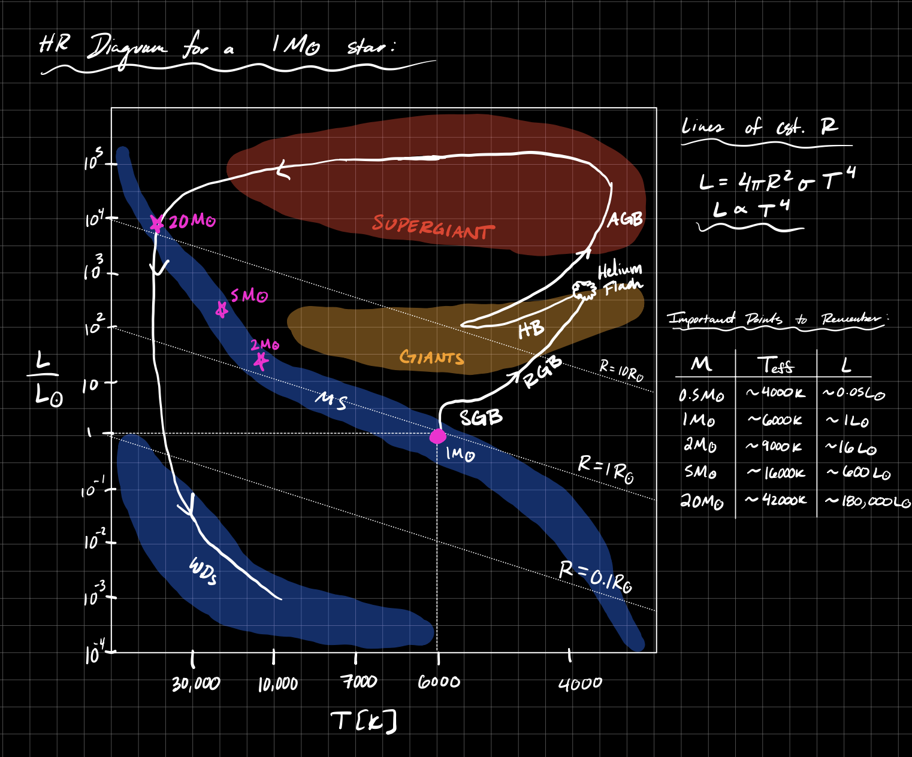

	The stages of evolution for a $1 \rm M_\odot$ star are given below 

	I) **Hayashi Track:** Helmholtz gravitational contraction of a protostellar core (timescale $\sim 50 \; \rm Myr$). This core is approximated as convective ($n = 3/2$ polytrope), ideal gas, with $\kappa_{H-}$ opacity. Essentially vertical contraction along $T_{\rm eff} \sim 2000-3000 \; \rm K$. 

	II) **Main Sequence:** H-Burning in the core (via pp-chain for $M\lesssim 2 \; \rm M_\odot$ and CNO for $M \gtrsim 2 M_\odot$), **this phase dominates the lifetime**. For the Sun this is $\sim 8 \; \rm Gyr$. 

	III) **Sub-Giant Branch (SGB) / Red Giant Branch (RGB):** The core burns all H -> He, the core contracts enough such that the temperature gets high enough for H-shell burning to occur. Shell burning causes the star to expand and cool due to negative specific heat implied by virial theorem. 

	IV) **Helium Flash:** H-shell burning increases He in core (He sinks) -> $\rho_c \uparrow$. The core becomes degenerate and pressure becomes independent of $T_{\rm c}$. This degeneracy pile up gradually increases $T_{\rm c}$ until $T_{\rm c} \sim 10^8 \; \rm K$. Then the $3\alpha$ process kicks on and He burning begins. The $3 \alpha$ process has a **steep dependence on $T_{\rm c}$** and begins to burn through He -> C & O **RAPIDLY** ($\sim 5 \%$ of He in ~ minutes). Once $3\alpha$ begins, the core becomes non-degenerate and rapidly expands -> cooling and contraction of outer layers. We note this doesn't happen if a star is sufficiently massive such that the core never becomes degenerate ($M \gtrsim 2 \; \rm M_\odot$).

	V) **Horizontal Branch (HB):** He core burning via $3 \alpha$ process and H-shell burning via CNO cycle.

	VI) **Asymptotic Giant Branch (AGB):** When the core runs out of He fuel -> core contracts and $T \uparrow$ -> He shell burning. He-shell undergoes periodic He flashes due to tendency to become degenerate. These flashes -> $\dot{M} \uparrow$ through stellar winds. 

	VII) **Post-AGB:** Stellar winds strip outer H & He envelopes, fusion stops, leaving behind an inert C-O core. The ejected outer layers form a planetary nebula. 

	VIII) **White Dwarf (WD):** C-O contracts and becomes a degenerate WD. WD cools rapidly by the emission of neutrinos. Then WD continues to cool by thermal emission until it becomes a "black dwarf" in $t \gg t_{H_0}$. 

	We also include a few evolutionary tracks on the same HR diagram for the sake of understanding more than just the Sun.  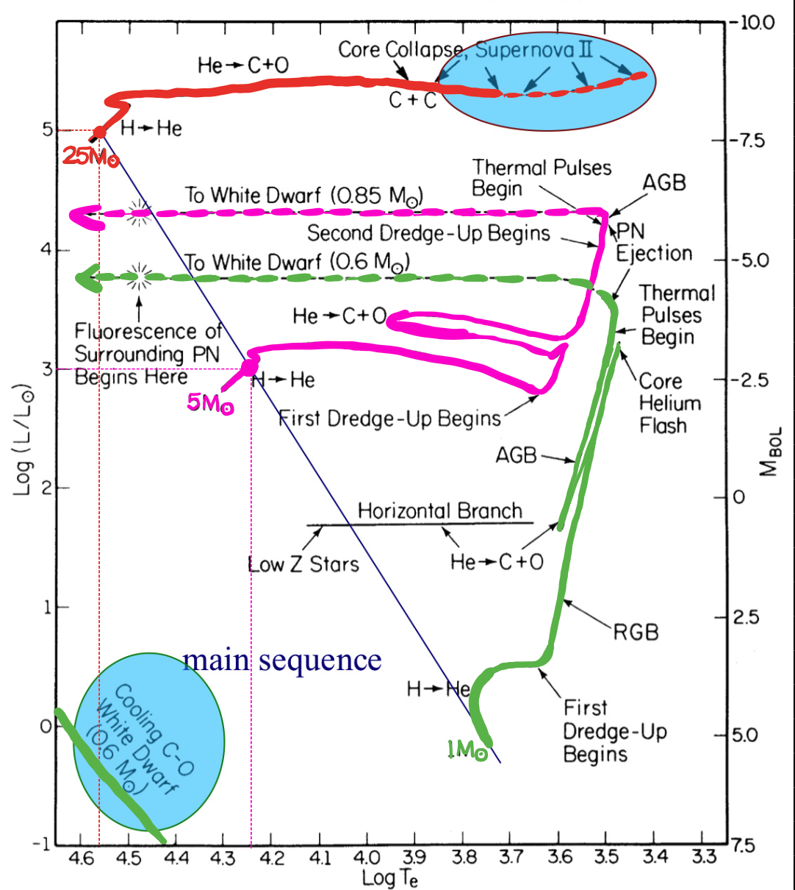 To determine the age of a Globular cluster, we know the stars form from the same IMF so there will be a distribution of stars that all formed at the same time. As time progresses, stars will begin to turn off the MS, measuring this turn off point can provide a good measurement of the age of the GC (see below). 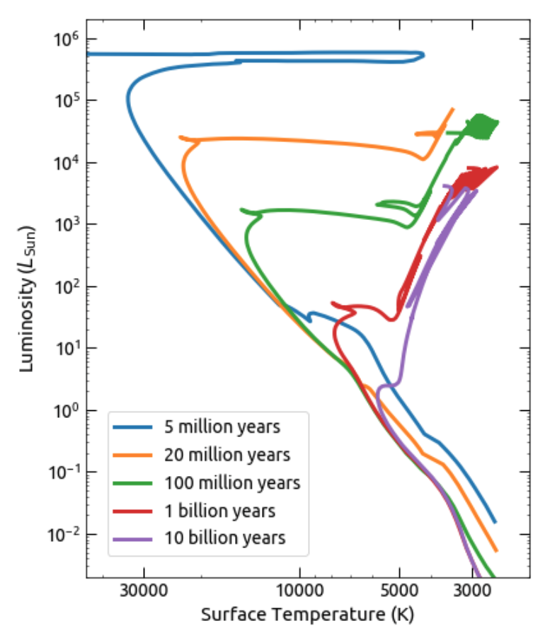 

	We summarize the approximate timescales below 

| Stage         | Timescale        |
| ------------- | ---------------- |
| Hayashi       | 50 Myr           |
| Main Sequence | 10 Gyr           |
| SGB           | 1 Gyr            |
| RGB           | 100 Myr          |
| He Flash      | minutes          |
| HB            | 100 Myr          |
| AGB           | 10 Myr           |
| Post-AGB      | 100 kyr          |
| WD            | $\gtrsim$ 10 Gyr |
	

2. Describe the spectral classification system for stars. What are some prominent lines in an A star? G star? M star?

	Each class has subclasses 0-9 where 0:hottest and 9:coolest. The Sun is a G2 star for example. M stars are $\sim 75 \%$ of all stars! The choice of letter for each class is in order of strength of Hydrogen absorption lines (A stars have the strongest Balmer absorption lines). 

	Notable Attributes: 
	
	**A:** Strongest Balmer Lines

	**G:** Strong $\rm Ca^+H$ and $\rm Ca^+ K$ lines among other Fraunhaufer lines due to $\rm O_2, Na, Mg, \& \; Fe$ 

	**M:** Strong lines from **Oxide Molecules** like $\rm TiO$. Also have neutral metal lines. Continuous absorption band due to $\rm TiO$ instead of narrow lines that are discrete.  
	
	**O:** No Balmer Lines, too hot!

| Class | $T_{\rm eff} \; \rm [K]$ | ZAMS Mass $[\rm M_\odot]$ |
| ----- | ------------------------ | ------------------------- |
| O     | $\gtrsim 30,000$         | > 16                      |
| B     | $30,000 - 10,000$        | [2,16]                    |
| A     | $10,000 - 7000$          | [1.5, 2]                  |
| F     | $7000 - 6000$            | [1, 1.5]                  |
| G     | $6000 - 5000$            | [0.8, 1]                  |
| K     | $5000 - 4000$            | [0.5, 0.8]                |
| M     | $4000 - 3000$            | [0.1, 0.5]                |

3. Using statistical mechanics, explain why the Balmer lines are most prominent in stars with effective temperatures near 10,000 K (A stars).

	At $T \sim 10,000 \; \rm K$ there is a significant fraction of neutral H in the n=2 state. If we assume LTE, the fraction of neutral H at level n state is 
	
	$$f_n = \frac{g_n e^{-E_n / kT}}{Z} \;\;\;\;\;\;\;\; \textrm{where} \;\;\;\; Z = \sum_{n = 1}^{\infty} g_n e^{-E_n / kT}$$ 
	
	We denote $Z$ as the partition function, $g_n = 2n^2$ to be the degeneracy factor, and $E_n = -13.6 \; \mathrm{eV} / n^2$. The ionization fraction is given by the Saha Equation 
	
	$$\frac{x^2}{1 - x} = \frac{1}{n_{\rm H} \lambda_B^3} e^{-E_1 / kT} \; .$$
	
	To get the total $n_{\rm H, 2}$ we have to account for the amount of neutral H in the n=2 state and how much of the H is ionized 
	
	$$n_{\rm H,2} = f_2 (1 - x) n_{\rm H} \; .$$
	
	This **quantity is maximized around** $T \sim 10,000 \; \rm K$, its a balance between raising $e^-$ to n=2 and becoming too hot to ionize the H. 

4. Consider a stellar photosphere with approximately constant temperature and opacity. Show that the pressure is approximately equal to the surface gravity divided by opacity. Show that if the pressure is dominated by radiation pressure, the star must be radiating nearly at the Eddington limit.

	We start with 2 fundamental equations 
	
	$$\frac{dP}{dr} = -\rho g \;\;\;\;\;\;\; d\tau = -\kappa \rho \; dr$$ 
	
	which we can combine to get 
	
	$$\frac{dP}{d\tau} = \frac{g}{\kappa} \rightarrow P_{\rm ph} = \int_0^{2/3} \frac{g}{\kappa} d\tau \approx \frac{2}{3} \frac{g}{\kappa}$$
	
	where we define the photosphere to be when the optical depth reaches $\tau = 2/3$. In summary we combine the equation of hydrostatic equilibrium with the definition of optical depth. 

	The total pressure can be written as a sum of the gas pressure and radiation pressure $P = P_{\rm rad} + P_{\rm gas}$, so if the radiation pressure dominates then $P \sim P_{\rm rad}$. The radiation pressure is commonly defined as $P_{\rm rad} = \frac{1}{3}a T^4$ where the radiation constant is $a = 4 \sigma_{\rm SB} / c$. We can use an additional equation of stellar structure 
	
	$$\frac{dP_{\rm rad}}{dr} = \frac{L_r}{4 \pi r^2} \frac{\kappa \rho}{c}$$
	
	If we combine this equation with the equation of hydrostatic equilibrium then we get 
	
	$$1 - \beta \approx \frac{dP_{\rm rad}}{dP} \approx \frac{\frac{L_r}{4 \pi r^2} \frac{\kappa \rho}{c}}{\rho g} \approx \frac{L \kappa}{4 \pi G Mc}$$
	
	where $\beta$ is equal to 0 if the star is fully radiative and 1 if its not radiative at all. If the star is dominated by radiation pressure then $1 - \beta \lesssim 1$ which gives us 
	
	$$L \lesssim \frac{4 \pi G M c}{\kappa} \; .$$

5. What is the meaning of the term “Rosseland mean opacity”? Why is it important? Sketch the Rosseland mean opacity of solar-composition gas as a function of temperature, for a few different densities, over the ranges of temperature and density relevant to stellar astrophysics.

	The Rosseland Mean is averaged over the Planck Spectrum: 
	
	$$\frac{1}{\kappa_R} \equiv \frac{\int_0^\infty \frac{1}{\kappa_\nu} \frac{\partial B_\nu}{\partial T} d\nu}{\int_0^{\infty} \frac{\partial B_\nu}{\partial T} d\nu} = \frac{\pi}{acT^3} \int_0^\infty \frac{1}{\kappa_\nu} \frac{\partial B_\nu}{\partial T} d\nu$$
	
	This is important because it means we **can ignore the $\nu$ dependence** and just worry about the energy transport! Super useful for stellar evolution codes like MESA. This "cheesy" diagram from class as Adam likes to call it, is very useful! 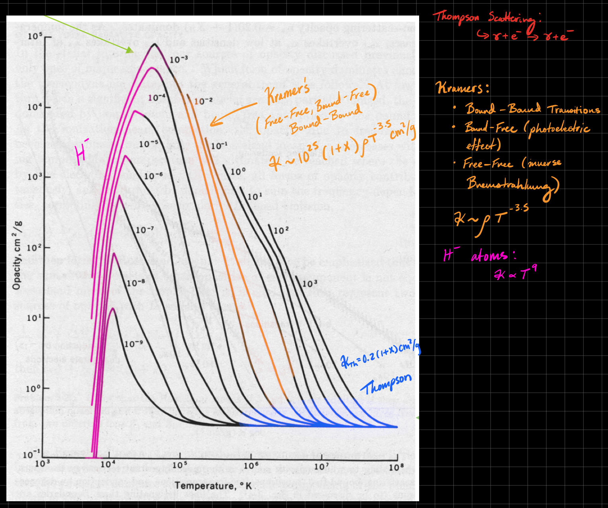

6. Describe the main nuclear fusion reactions occurring in the Sun, and in a 2 M⊙main-sequence star.

	The most important nuclear reaction networks for 1 and 2 solar mass star are the pp-chain and the CNO cycle respectively. 

	**PPI) - Important for $M \sim 1 \; \rm M_\odot$** 
	
	$$\rm p + p \rightarrow D + e^+ + \nu_e \;\;\; (rate \; limiting)$$
	
	$$\rm D + p \rightarrow ^3He + \gamma$$
	
	$$^3\rm He + ^3\rm He \rightarrow ^4\rm He + 2p$$
	
	The PPII and PPIII chains are also off-chutes of the PPI chain. The PPII chain uses $\rm ^7 Li$ and $\rm^7 Be$ to fuse He and the PPIII chain uses $\rm ^8 B$ as an intermediate to fuse He. Those chains are important because the produce electron neutrinos which can be measured here on Earth (John Bahcall's Solar Neutrino Problem). 

	The PP chains consist of electromagntic, weak nuclear, and strong nuclear interactions. To remember which is what I remember the acronym **WES-EWS-EW** for the PPI,II,III respectively. A weak nuclear interaction will emit a neutrino and a positron, an electromagnetic will emit a photon, and a strong will not emit anything.

	**CNO) - Important for $M \sim 2 \; \rm M_\odot$** 
	
	$$\rm ^{12}C + p \rightarrow ^{13} N + \gamma$$ 
	
	$$\rm ^{13}N \rightarrow ^{13} C + e^+ + \nu_e$$ 
	
	$$\rm ^{13}C + p \rightarrow ^{14} N + \gamma$$ 
	
	$$\rm ^{14}N + p \rightarrow ^{15} O + \gamma \;\;\;\;\; (rate \; limiting)$$ 
	
	$$\rm ^{15}O \rightarrow ^{15} N + e^+ + \nu_e$$
	
	$$\rm ^{15}N + p \rightarrow ^{12} C + ^4He$$

	There are various versions of the CNO cycle that come into play at hotter temperatures and in shell burning. The CNO cycle is just a series of proton captures and $\beta$ decays, an acronym I like to use to remember which are the decays and which are the proton captures is **CDC-CDC**. 

	For nuclear burning, this plot is super important  where 
	
	$$\eta = \frac{\partial \ln \overline{\sigma v}}{\partial \ln T}$$
	
	the core temperature range for pp-chain is $T_{\rm c} \sim 10^{6.5 - 7.5} \; \rm K$ and the range for CNO is $T_{\rm c} \sim 10^{7.2 - 7.6}$. The Gamow Peak is important hear and is the effective energy where a reaction will proceed. 

7. What is the approximate mass-radius relationship for lower main-sequence stars? Provide a simple physical explanation for this observed relationship.

	We can derive this relationship by assuming a **homologous star**. There are 4 components to the homologous star

	I) **Hydrostatic Equilibrium** 
	
	$$\frac{dP}{dr} = -\rho g \;\;\;\;\; \longrightarrow P \sim \frac{GM^2}{R^4}$$
	
	II) **Equation of State** 
	
	$$P = nk_B T \longrightarrow P \sim \rho T$$ 
	
	if we combine with the hydrostatic equilibrium equation for pressure we get $T \sim M/R$. 

	III) **Energy Transport:** We can assume Radiative diffusion to be the primary means of energy transport 
	
	$$L \sim \frac{R^2 T^4}{e^\tau} \sim \frac{R^2 T^4}{\kappa \rho R}$$ 
	
	and we can assume **Kramer's Opacity** $\kappa \propto \rho T^{-3.5}$. When we combine these we have 
	
	$$L \sim \frac{R^7 T^{7.5}}{M^2}$$
	
	IV) **Energy Generation:** we assume nuclear burning by CNO ($L \sim \varepsilon M$) where $\varepsilon \propto \rho T^{20}$ for the CNO cycle. Plugging this in and combining everything we arrive at 
	
	$$R \propto M^{0.73}$$ 
	
	which is close enough to the observed relation $R \propto M^{0.8}$.

8. What is the approximate mass-luminosity relationship for main-sequence stars? How does the main-sequence lifetime depend on stellar mass?

	The lifetime of a star on the MS is given by 
	
	$$t_{\rm MS} \approx 0.007 \frac{M_{\rm core} c^2}{L} \; ,$$
	
	thus if we have the M-L relation we can determine the lifetime scaling with mass. The important M-L relations for stars on the MS are 

| Relation            | Mass Range                                          |
| ------------------- | --------------------------------------------------- |
| $L \propto M^{2.3}$ | $M > 0.4 \; \rm M_\odot$                            |
| $L \propto M^4$     | $M < 2 \; \rm M_\odot$                              |
| $L\propto M^{3.5}$  | Most of the MS                                      |
| $L \propto M$       | For high mass stars ($M \gtrsim 50 \; \rm M_\odot$) |

	
9. What is the minimum mass for a star to derive energy from proton-proton fusion? What physical criteria determine this minimum mass?

	The minimum mass is $M_{\rm min} \sim 0.08 \; \rm M_\odot$, this is because the $T$ of the degenerate core reaches $T_{\rm c} \gtrsim 6 \times 10^{6} \; \rm K$ as it contracts along the Hayashi Track, allowing H-burning to start via the pp-chain. For deuterium the minimum mass is about $M_{\rm min} \sim 10 \; \rm M_{\rm jup}$.

	We can understand how this minimum mass is derived by creating a frankenstein E.O.S 
	
	$$P \approx \left[ \underbrace{\left( \frac{k_B}{\mu m_{\rm H}} \rho T \right)^2}_{\rm ideal \; gas} + \underbrace{\left(K_1 \rho^{5/3} \right)^2}_{\rm degenerate} \right]^{1/2} \; ,$$
	
	where we combine ideal gas contribution and a degenerate contribution. We will **take the limits to find the maximum core temperature that corresponds to the minimum ignition mass**. First we can solve for the temperature by using hydrostatic equilibrium $\rho \sim M / R^3$ and $P \sim GM^2 / R^4$ and we get 
	
	$$T \sim \frac{\mu m_{\rm H}}{k_B} \frac{GM}{R} \left[ 1 - \left(\frac{K_1}{GRM^{1/3}} \right) \right]^{1/2}$$
	
	From here we take the limits. 

	The **Degenerate Limit** is when $P_{\rm deg} \gg P_{\rm ideal}$ : $R_{\rm min} = \frac{K_1}{N_n G M^{1/3}}$ 
	The **Thermal Pressure Limit** is when $P_{\rm ideal} \gg P_{\rm rad}$ : $T_{\rm c} = 0.539 \frac{\mu m_{\rm H}}{k_B} \frac{GM}{R}$ 

	By combining the limits we get  
	
	$$T_{\rm c} \sim 0.54 \frac{\mu m_{\rm H}}{k_B} \frac{GM}{R} \left[1 - \left(\frac{R_{\rm min}}{R} \right)^2 \right]^{1/2} \; .$$
	
	To find the maximum core temperature the star can achieve we have to maximize the function by differentiating with respect to the radius. We find $R_0 = \sqrt{2} R_{\rm min}$ which we then plug into the above expression and find the maximum core temperature relation to mass is 
	
	$$T_{\rm c,max} \sim 6 \times 10^6 \; \rm K \left[\frac{M}{0.08 \; \rm M_\odot} \right]^{4/3} \; .$$

10. What is the “triple-α” process? For what types of stars does it occur?

	The $3 \alpha$ process is described by the following reaction
	 
	$$\rm ^4 He + ^4 He \rightarrow ^8 Be^* \;\;\;\;\; \longrightarrow \;\;\;\;\;\; \rm ^4 He + ^8 Be^* \rightarrow ^{12} C + 2 \gamma$$

	The $3\alpha$ process serves as the origin of Carbon in the star. We can also have a followup reaction with an additional $\alpha$ particle to get $\rm ^4 He + ^{12} C \rightarrow ^{16} O + \gamma$ which serves as the dominant origin of oxygen in the universe. 

	This only occurs when the temperature is really hot $T \gtrsim 10^8 \; \rm K$ (see fusion reaction energy density vs temperature plot). This can occur in the core of a star during the horizontal branch phase of stellar evolution or in the He-burning shell during the AGB phase. 

	Important aside, $\rm ^8 Be$ is metastable, it decays into 2 He nuclei in $\sim 10^{-16} \; \rm s$. The abundance of Be is set by the Saha equation 
	
	$$\frac{n_\alpha^2}{n_{\rm Be}} = \left( \frac{2 \pi \mu kT}{h^2}\right)^{3/2} e^{-Q/kT}$$
	
	where $Q = -92 \; \rm keV$ and $\mu = m_\alpha^2 / m_{\rm Be} \sim 2 m_{\rm p}$. At $T \sim 10^8 \; \rm K$ we get a relative abundance of Be to He of $10^{-8}$. 

11. Explain the meaning of the Brunt-Vaïsäla frequency and how it is derived. How is the value of this frequency related to the mechanism of heat transport within a star?

	The BV frequency is a useful quantity for determining the stability of a fluid to convection. It is common to derive it in the context of mixing length theory. We can consider the buoyancy of fluid elements in an average temperature profile.

	If we suppose a blob of fluid is displaced $\delta r$ from its equilibrium position, the change in pressure is then 
	
	$$\delta P = \bar{P}(r + \delta r) - \bar{P} \approx \frac{d\bar{P}}{dr}\delta r \;,$$
	
	where we assume the blob is in pressure equilibrium with the ambient medium. The change in $\rho$ is adiabatic so that 
	
	$$\delta \rho = \left(\frac{d\rho}{dP} \right)_S \delta P = \left(\frac{d\rho}{dP} \right)_S \frac{d\bar{P}}{dr} \delta r$$
	
	we can define the density contrast as 
	
	$$\Delta \rho \equiv \underbrace{\delta \rho}_{\rm blob} - \underbrace{\frac{d\bar{\rho}}{dr}\delta r}_{\rm ambient \; \nabla\rho} = \frac{d\bar{P}}{dr} \left[\left(\frac{d\rho}{dP} \right)_S - \frac{d\bar{\rho}}{d\bar{P}} \right] \delta r$$
	
	The sign of the RHS is crucial. If $\Delta \rho$ has the same sign as $\delta r$ then negative feedback occurs: blob gets overdense when it rises and underdense when it falls, so this is stable. If $\Delta \rho / \delta r < 0$ then we are **unstable to convection**. 

	To derive the BV frequency we can write the force per unit volume as 
	
	$$\mathbf{f} = - \underbrace{(\bar{\rho} + \Delta \rho) g}_{\rm gravity} - \underbrace{\frac{dP}{dr}}_{\rm pressure} = -\left(\bar{\rho} g + \frac{dP}{dr}\right) - \Delta \rho g = \frac{\Delta \rho}{\bar{\rho}} \frac{d\bar{P}}{dr}$$ 
	
	and recognize that $f = \bar{\rho} \delta \ddot{r}$. If we plug everything in we get 
	
	$$\delta \ddot{r} = \left(\frac{1}{\bar{\rho}} \frac{d\bar{P}}{dr} \right)^2 \left[\left(\frac{d\rho}{dP} \right)_S - \frac{d\bar{\rho}}{d\bar{P}} \right] \delta r = -N^2 \delta r$$ 
	
	where $N$ is the BV frequency. If $N^2 > 0$ then the fluid is stable to convection, if $N^2 < 0$ then the fluid is unstable to convection. 

	All that was fun and all... but how is this practically useful? Well one can write it in a different general form 
	
	$$N^2 = -\underbrace{T}_{+} \frac{dS}{dr} \underbrace{\frac{d\ln P}{dr} \nabla_{\rm ad}}_{+} \propto -\frac{dS}{dr}$$ 
	
	where $S$ is the entropy of the fluid and 
	
	$$\nabla_{\rm ad} \equiv \frac{1}{\gamma}\left( \frac{\partial \ln T}{\partial \ln \rho} \right)_S \; .$$
	
	This form is particularly insightful because we can see the **"Schwartzchild"** criterion for convection very clearly, which basically states that **when low-entropy fluid is on top of high-entropy fluid then we are unstable to convection.**

	One can also assume the ideal gas law and write the BV frequency as 
	
	$$N^2 = -\frac{P}{\rho} \left( \frac{d\ln P}{dr}\right)^2 (\nabla - \nabla_{\rm ad})$$
	
	where $\nabla$ has the same definition of $\nabla_{\rm ad}$ just not at constant entropy. When $\nabla > \nabla_{\rm ad}$ then the fluid is said to be **superadiabatic** which means it is unstable to convection. 
	
12. What are the main categories of variable stars? What are Cepheid variables and why are they important? What is the κ-mechanism for stellar pulsations?

	The main classes of variable stars are: 

	I) **Classical Cepheids:** $M \sim 5 - 20 \; \rm M_\odot$, supergiants in the instability strip. They have $P \sim 1-100 \; \rm days$. They follow a P-L relation.

	II) **RR-Lyraes:** $M \sim 0.5 - 0.8 \; \rm M_\odot$, horizontal branch stars in the instability strip with $P \sim 0.2 - 1 \; \rm days$. They follow a P-L relation.

	III) **δ-Scuti Stars:** $M \sim 1.5 - 2.5 \; \rm M_\odot$, MS or SGB stars in the instability strip with $P \sim 0.03 - 3 \; \rm days$. 

	IV) **Mira Variable Stars:** AGB stars with κ-mechanism pulsations from partial H ionization zone with $P \sim 100 - 1000 \; \rm days$. 

	V) **β-Cepheids:** $M \sim 8 - 16 \; \rm M_\odot$, B-stars with κ-mechanism pulsations from partial Fe ionization zone with $P \sim 0.1 - 0.5 \; \rm days$

	VI) **ZZ-Ceti Stars:** WD stars that pulsate when the WD evolutionary track crosses the instability strip (with $T_{\rm eff} \sim 10^4 \; \rm K$). They have $P \sim 30 - 1200 \; \rm seconds$, caused by κ-mechanism in the outer atmosphere due to partial H ionization. 

	Of these variable stars, C**epheids are the most important because they follow a period-luminosity relation** found by Henrietta Swan-Leavitt 
	
	$$\langle m_I \rangle \approx -3 \log \left( \frac{P}{\rm 1 \; day} \right) - 2$$
	
	where $m_I$ is the apparent magnitude in the I-band. Cepheids play a crucial role in the distance ladder. 

	Most variable stars are powered by the κ-mechanism, although it is theorized that the ε-mechanism can create radial stellar pulsations as well. These mechanisms can be understood by perturbing the equations of stellar structure, a perturbation in luminosity then can be written as 
	
	$$\delta L \sim \delta \dot{P} - c_s^2 \delta \dot{\rho} \sim \rho \; \delta \left( \underbrace{\varepsilon_n}_{\rm nuclear \; burning} - \underbrace{\frac{\nabla \cdot \mathbf{F}}{\rho}}_{\rm flux} \right) \; .$$
	
	We've assumed the background to be adiabatic such that $\nabla \cdot \mathbf{F} / \rho = \partial L / \partial M = \varepsilon_n$. Then we ask, do we get a net heating (excitation from $\varepsilon_n$ or $\nabla \cdot \mathbf{F}$) as we follow a non-adiabatic pulsation (like a Carnot engine) 
	
	$$W = \oint \frac{dE}{dt} dt$$ 

	where 

	$$\frac{dE}{dt} = \int_0^M \delta T \underbrace{\frac{d\delta S}{dt}}_{\frac{1}{T} \delta \left(\varepsilon_n - \frac{\nabla \cdot \mathbf{F}}{\rho} \right)} dM$$ 
	
	which can be decomposed into a nuclear burning component and a flux component 

	$$\mathrm{nuclear \; burning:} \;\;\;\;\; \frac{dE}{dt} = \int \frac{\delta T}{T} \delta \varepsilon_n dM = \int_0^M dM \varepsilon_n \left[ \varepsilon_T + \frac{\varepsilon_\rho}{\Gamma_3 - 1} \right] \left( \frac{\delta T}{T} \right)^2$$
	
	$$\mathrm{flux:} \;\;\;\;\;\frac{dE}{dt} = -\int \frac{\delta T}{T} \delta \left(\frac{\nabla \cdot \mathbf{F}}{\rho} \right) dM = \int_0^M dM \frac{dL}{dM} \left[ \kappa_T + \frac{\kappa_\rho}{\Gamma_3 - 1} \right] \left( \frac{\delta T}{T} \right)^2$$

	where $\delta T/T$ is the eigenfunction for a single frequency (like each perturbing wave has a characteristic frequency, each blob has a characteristic temperature fluctuation). We define  a few quantities 
	
	$$\kappa_{\rho} \equiv \frac{\partial \ln \kappa}{\partial \ln \rho} \bigg|_{T} \;\;\;\;\;\;\;\;\; \kappa_{T} \equiv \frac{\partial \ln \kappa}{\partial \ln T} \bigg|_{\rho}$$ 
	
	$$\varepsilon_{\rho} \equiv \frac{\partial \ln \varepsilon_n}{\partial \ln \rho} \bigg|_{T} \;\;\;\;\;\;\;\;\; \varepsilon_{T} \equiv \frac{\partial \ln \varepsilon_n}{\partial \ln T} \bigg|_{\rho} \; .$$
	
	In practice, these are just the exponents in the expressions $\kappa \propto \rho^\alpha T^\beta$ or $\varepsilon_n \propto \rho^\alpha T^\beta$.

	The upshot of all of this, is that when 
	
	$$\left[ \kappa_T + \frac{\kappa_\rho}{\Gamma_3 - 1} \right] > 0$$
	
	we will have a driving region which will lead to coherent radial stellar pulsations. This is referred to as the **κ-mechanism**. We know that $\kappa_\rho$ is almost always positive and $\kappa_T$ is typically negative (e.g. Kramers $\kappa \propto \rho T^{-3.5}$) but **sometimes this is not true**. In particular, when we have **partially ionized species** that can alter the slope of $\kappa$ with respect to $T$, effectively **deviating from Kramers' Opacity** (see below) 

	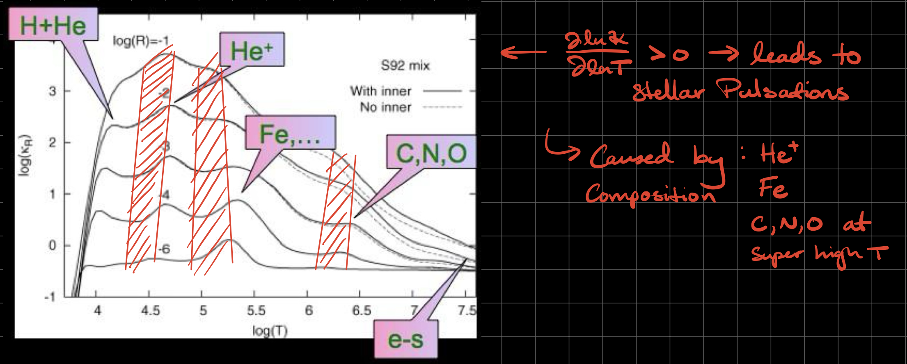

	When $\partial \kappa / \partial T \geq 0$ then we are susceptible to coherent radial stellar pulsations.  For example, in Cepheids, the κ-mechanism is powering their radial pulsations and $\rm He^+$ is thought to be responsible for the pulsations. In simple words, if $\kappa \uparrow$ with $T \uparrow$, then a blob of fluid deep in the star will become more opaque and thus absorb more flux from the inner regions of the star which will eventually cause the blob to get so hot that it rises upward (also from radiation pressure) which will allow the the blob to cool back down and it will then sink, closing the loop. This can only occur because $\rm He^+$ alters Kramers' opacity to have a positive slope w.r.t temperature! 

	We can also have the ε-mechanism driving pulsations with a similar condition 
	
	$$\left[ \varepsilon_T + \frac{\varepsilon_\rho}{\Gamma_3 - 1} \right] > 0 \; ,$$
	
	if this is true then we will get a driving region which will lead to coherent radial stellar pulsations. If we look at any nuclear burning rate (pp-chain $\varepsilon_n \propto \rho T^{4}$, CNO $\varepsilon_n \propto \rho T^{20}$, 3α $\varepsilon_n \propto \rho^2 T^{40}$) we would expect that this quantity should be positive and thus **we should see ε-mechanism!** Unfortunately, the oscillations get suppressed throughout the star so we only see this in some cases of shell burning but it's very rare, **most variable stars are powered by the κ-mechanism.**

	In summary, the κ-mechanism is important for explaining non-adiabatic stellar pulsations in the outer layers of stars (Kramers is stable, deviations due to partial ionization are not). Classical cepheids are caused by the $\rm He^+$ bump in $\kappa(T)$, β-Cepheids are caused by $\rm Fe$ bump in $\kappa(T)$, and RR Lyraes, γ-Doradus, and δ-Scuti are all due to $\rm H + He$ bump. 
	
	Variable stars are commonly found on the **instability strip** $5500 \; \mathrm{K} \lesssim T_{\rm eff} \lesssim 7500 \; \rm K$. The lower bound comes up because convection reaches the region and the upper bound comes from the fact that ionization zones get too close to the surface. 

	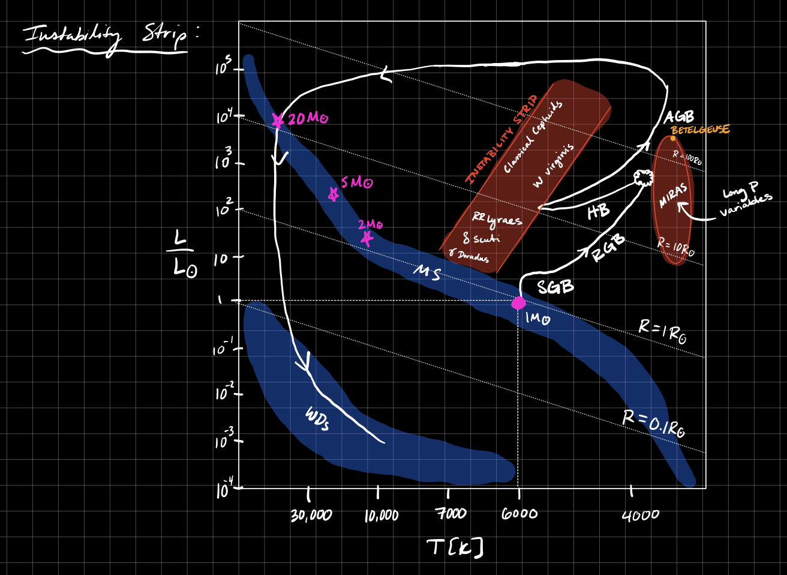
	

13. What are p and g mode oscillations of a star? How are they observed and distinguished? What are the typical frequencies for a Sun-like star? If the p-mode spectrum is measured, what quantities can be determined about the stellar interior?

	Stars can have adiabatic pulsations, some of which are **non-radial** (p & g modes) commonly described with spherical harmonics $Y_{\ell m}(\theta, \varphi)$. We make the **cowling approximation** that the stars structure varies more slowly with radius than the perturbations. 

	The dispersion relation is given by 
	
	$$k^2 = \frac{\omega^2}{c^2} \left(1 - \frac{S_\ell^2}{\omega^2} \right) \left(1 - \frac{N^2}{\omega^2} \right)$$
	
	where $S_\ell \equiv \ell (\ell + 1) c_s^2 / r^2$ and $N$ is the Brunt-Vaïsäla frequency. There are 2 cases that produce a real wavenumber: 

	I) $\omega^2 > S_\ell^2$ and $\omega^2 > N^2$ : **p-modes, pressure is the restoring force.**
	II) $\omega^2 < S_\ell^2$ and $\omega^2 < N^2$ : **g-modes, buoyancy is the restoring force.**

	If either of these conditions are not met, the wave is considered **evanescent** (aka exponentially damped). 
	
	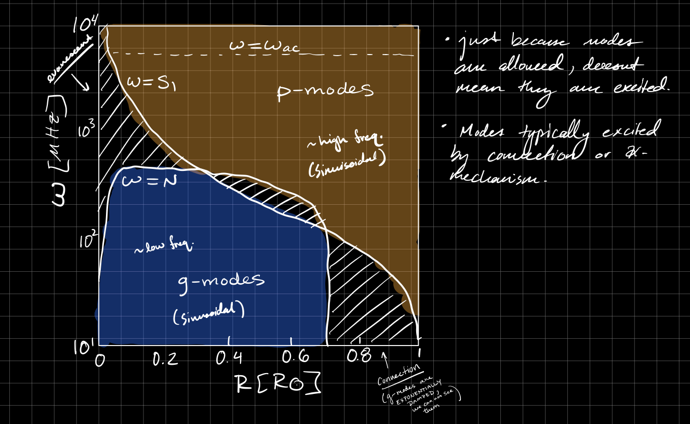

	When we do helioseismology we can probe thousands of $\ell$ modes which provide fantastic constraints on the Sun's properties including its' age (assuming composition) and structure! Note g-modes are usually really hard to observe because they are embedded deep within the star so they are damped observationally. Asteroseismology tries to measure f-modes and p-modes in other stars but its much harder and they can only probe a few of the first $\ell$ modes. 
	
	The f-mode is also called the "fundamental" mode. These modes are oscillations on the surface of the star due to surface gravity waves, they pulsate on the order of the dynamical or free-fall time. They are typically excited by collisions or dynamical tides in binary systems. The last kind of modes are r-modes which are "Rossby" modes which come from rapid rotation (found in binary neutron star systems for example). 

	p-modes have a frequency given by $f_p \sim (n + \ell/2) \frac{c_s}{2 R_*}$ and in the **Sun the frequency is of order 5 minutes**. They are measured in the Sun with high resolution doppler spectroscopy of the surface and mapping surface intensity variations (GONG, GOLG, SOHO, SDO). In Asteroseismology we can probe a few p-modes by changes in brightness with changing photosphere using (Kepler, TESS, CoRoT). 
	
	The rotation of the Sun can also induce a Zeeman-like splitting of the frequencies of the p-modes allowing us to measure the **rotation profile of the Sun** with exquisite detail along with the **sound speed profile to determine the Tachocline** (boundary between radiative and convective zones). We've learned that the convective zone differentially rotates (faster at lower lattitude) while the radiative zone rotates as a solid body.

14. What is degeneracy pressure? Sketch pressure versus density for a degenerate electron gas, over the range of densities relevant to stars.

	**Degeneracy Pressure:** Effective pressure of a **cold fermion gas** produced by their quantum mechanical zero-point energy. Think of it as a manifestation of the Pauli Exclusion principle where no 2 fermions can occupy the same quantum state because the wavefunctions will deconstructively interfere.

	It is worth while to take a slight detour to explain this further. The distribution function in general for particles in 6D phase space is 
	
	$$f = \frac{1}{e^{(E - \mu)/kT} \pm 1}$$
	
	where + corresponds to fermions and - corresponds to bosons, $E$ is the energy of the particle, $T$ is the temperature, $\mu$ is the chemical potential, and $g$ is the particle degeneracy. The total number density of your particles can be acquired by integrating over momentum space 
	
	$$n(x) = g \int f \; d^3p = \frac{g}{h^3} \int f \; 4\pi p^2 dp$$
	
	and one can weight this integral by the typical kinetic energy of a particle to get the energy density of the gas. If the gas is non-relativistic ($p \ll mc$) then $E_k \approx p^2 / 2m$ and $U = \frac{3}{2}P$ and if the gas is relativistic ($p \sim mc$) then $E_k \approx pc$ and $U = 3 P$. The energy density is formally written as 
	
	$$U = \frac{g}{h^3}\int E_k(p) \cdot f \cdot 4\pi p^2 dp$$
	
	this is the same as the distribution function in dynamics except now instead of stars we're talking about particles in a gas. 

	From this definition of the distribution function, we can get all of our famous useful relations for gasses in astrophysics. 
	
	For example, we can get the **Maxwell-Boltzmann** distribution by simply taking the limit that $mc^2 \gg E - \mu \gg kT$ so that $f \gg 1$ which if we plug into the expressions above we get $U = \frac{3}{2} nkT$ and $P = nkT$. 

	If we want the **Planck** distribution we just assume photons are bosons and that $\mu = 0$ and $E = h \nu$ then we arrive at 
	
	$$n_\nu d\nu = \frac{8\pi\nu^2}{c^3} \frac{1}{e^{h\nu/kT} - 1}d\nu$$
	
	and by extension we get $U = a T^4 = \frac{4\pi}{c} B_\nu(T)$ with 
	
	$$B_\nu(T) d\nu = \frac{2h\nu^3}{c^2} \frac{1}{e^{h\nu/kT} - 1} d\nu \; .$$

	Lastly, if we want to talk about degenerate gas then we need the **Fermi-Dirac** distribution of cold and dense fermions ($E \ll \mu$ and $kT \ll \mu$). In this case the distribution function is unity when $p \leq p_F$ and zero otherwise. In the Fermi-Dirac distribution one can compute the number density of electrons as a function of the Fermi momentum 
	
	$$n_e = \frac{2}{h^3}\int_0^{p_F} f \cdot 4\pi p^2 dp = \frac{8 \pi}{3} \frac{p_F^3}{h^3} \; .$$

	This will be useful in deriving the Chandrasekhar limit. A useful note for getting a gauge of degeneracy is given by the ratio of the debroglie wavelength and the interparticle spacing 
	
	$$\frac{p_F^2}{2 mkT} \sim \left(\frac{\lambda_B}{n_e^{-1/3}}\right)^2 \; .$$ 
	
	Intuitively, this is when the debroglie wavelengths begin to overlap. 

	Below we include a useful reference figure for different Equations of State relevant to stars.

	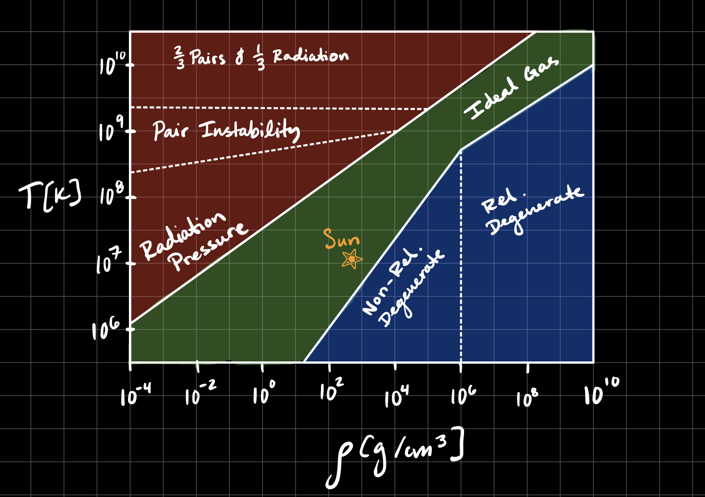
 

15. Perform a simple derivation of the Chandrasekhar limit, or give a heuristic physical explanation.

	Heuristically, this is when a WD accretes enough mass from a companion such that the star's degeneracy pressure transitions from being non-relativistic to ultra-relativistic. By the Virial theorem $\Omega = -(3 - \gamma) E_{\rm th}$ the star will become weakly gravitationally bound and **this transition triggers a thermonuclear runaway** leading to a thermonuclear explosion.

	The Chandrasekhar mass can be determined by finding what the mass corresponding to this transition is. From the previous problem we learned that $n_e \sim p_F^3/\hbar^3$ for a cold degenerate gas (where $p_F$ is the Fermi momentum). In the ultra-relativistic limit the Fermi energy is related to the fermi momentum $E_F = p_F c \sim \hbar c n_e^{1/3}$ and the pressure of the gas is given by $P \sim E_F n_e$. We can write in terms of mass density by saying $n_e \sim \rho N_A Y_e$ where $Y_e \sim 1/ \mu_e$ is the electron fraction and $N_A \sim 1 / m_p$ is Avogadro's number. 
	
	An ultra-relativistic gas is described by a $n=3$ polytrope which has the special property that the equation of state is directly related to the polytropic structure (only true for $n=3/2$ and $n=3$ degenerate gasses). With this we can write and solve for $K_2$ 
	
	$$K_2 \left({\frac{n_e}{N_A Y_e}}\right)^{4/3} \sim \hbar c n_e^{4/3} \;\;\;\; \longrightarrow \;\;\;\; K_2 \sim \hbar c \left(Y_e N_A \right)^{4/3}$$ 
	
	and we have the polytropic radius-mass relation $$R^{(3-n)/n} M^{(n-1)/n} \sim \frac{K_2}{G}$$
	
	which we can see for $n=3$ is independent of radius. Putting it all together we get the Chandrasekhar mass limit 
	
	$$M_{\rm ch} \sim \left( \frac{\hbar c}{G} \right)^{3/2} (Y_e N_A)^2 \sim \frac{m_{\rm planck}^3}{m_p^2} Y_e^2 \sim 1.4 \; \mathrm{M_\odot} (2Y_e^2)$$

16. Draw the binding energy curve (B/A versus A) of atomic nuclei ranging from hydrogen to uranium. Explain the most important features of the binding energy curve for astrophysics.

	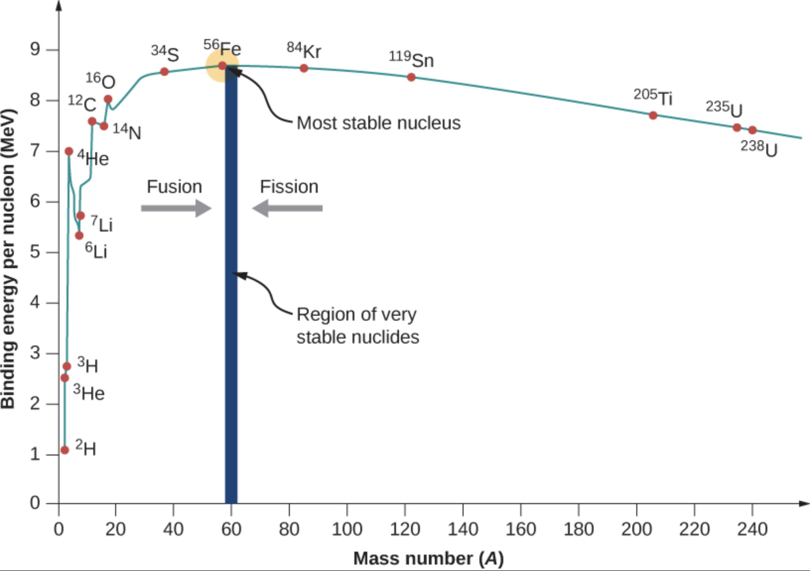

	Magic Numbers: 4, 8, 20, 28, 50, 82, 126. The B/A on the y-axis can be computed by 
	
	$$\frac{B}{A} = -\frac{M(A,Z) - (A - Z)m_n - Z(m_p + m_e)}{A}$$ 
	
	where $M(A,Z)$ is the nuclear mass. This can be computed with the Semi-Empirical Mass Formula "Drop Model" 
	
	$$M(A,Z) = \underbrace{(A - Z) m_n + Z(m_p + m_e)}_{\rm rest \; mass} - \underbrace{a_1 A}_{\rm bulk} + \underbrace{a_2 A^{2/3}}_{\rm surface \; tension} + \underbrace{a_3 \frac{(A/2 - Z)^2}{A}}_{\rm symmetry \; energy} + \underbrace{a_4 \frac{Z^2}{A^{1/3}}}_{\rm coulomb} + \underbrace{a_5 \frac{\delta}{A^{3/4}}}_{\rm pairing}$$

	B/A is the energy liberated by nuclear fusion/fission and is directly related to the $0.007$ factor in the lifetime of a star on the MS due to nuclear burning. 

17. What is meant by the s and r processes for the formation of heavy elements? In what astrophysical settings might these processes take place?

	**S**low and **R**apid neutron capture processes. When nuclei capture neutrons, they are typically **unstable** and will β-decay to the valley of β-stability along stable isobars (i.e conserving mass number) 
	
	$$\rm ^A_Z X \rightarrow ^A_{Z+1} X + e^- + \nu_e$$
	
	The s-process occurs when the **neutron capture timescale is longer than the β-decay timescale**, allowing nuclei to decay to β-stability between neutron captures. 

	The r-process occurs when the **neutron capture timescale is much shorter than the β-decay timescale**, allowing nuclei to capture many neutrons before decaying to the β-stability.  

	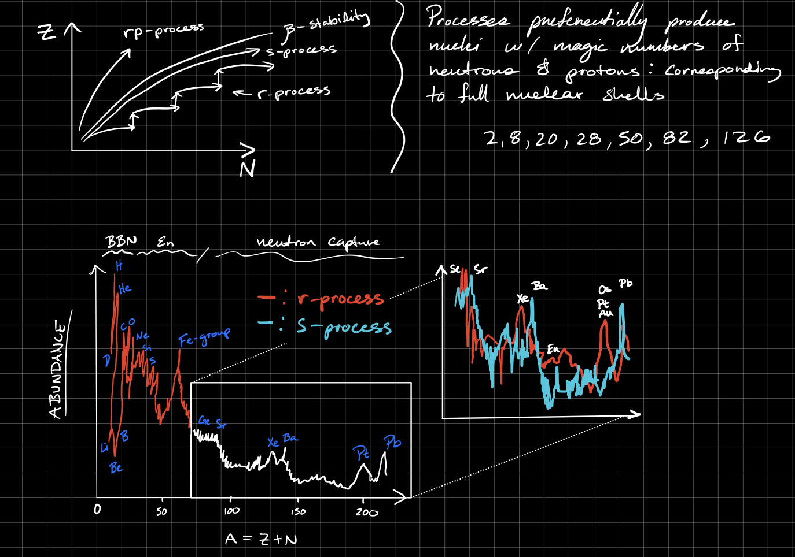

	We see cosmic abundance peak at lower A due to r-process rather than due to s-process because with r-process nuclei reach magic numbers with fewer protons. The r-process primarily occurs in ejecta from BNS mergers or magnetar flares. The s-process primarily occurs in AGB stars, both processes contribute roughly equal amounts to heavy elements. 

18. What are Population I, II, and III stars?

	Population groups are basically just defined based on metallicity. 

	**Population I)** Stars forming after $\sim 3 \; \rm Gyrs$ (after cosmic noon) which are the most metal enriched by the previous generations of stars. They can be found in the spiral arms of the MW and includes the Sun. 

	**Population II)** Stars formed before $\sim 3 \; \rm Gyrs$ (before cosmic noon). They have lower metallicities $Z \sim 10^{-3} - 10^{-1} Z_\odot$, but they tend to have higher $\rm \alpha/Fe$ ratio because Type Ia are responsible for most the Fe-peak elements and these take ~ Gyrs to form. They are found in the galactic bulge and galactic halo. When $Z \downarrow$ then $\kappa \downarrow$, this means higher radiation flux throughout the star, forcing the core to contract so that the nuclear burn rate can balance the surface luminosity. The **upshot is that Pop II stars evolve faster than Pop I Stars**. 

	Additionally, **in Pop II stars, stellar winds are suppressed** because they have less metals and by extension less dust in the upper atmosphere than can be driven by the radiation pressure from the star. This means these stars have less mass loss which leads to bigger cores, and **more NS and BHs that form from Pop II stars!**

	**Population III)** These would be stars that formed with **primordial gas with no metals!** These have never been observed, but they are expected in the first generation of galaxies. We expect **inefficient cooling** of primordial gas, they likely had a **top-heavy IMF** relative to Pop I and Pop II stars. They serve as a proposed explanation for SMBH seeding. We might expect exotic SNe explosions as well: e.g. pair-instability SNe ($> 130 \; \rm M_\odot$) or hypernovae triggered by photodisentregation ($>250 \; \rm M_\odot$). 
	

19. What is meant by the Initial Mass Function? Sketch this function and describe its key features. How is it determined observationally?

	The Initial Mass Function (IMF) describes the initial distribution of stellar masses for a population of stars. It is thought to be roughly universal for Population I stars (but disputed). 

	The IMF is often described by empirical fits, the 3 most common IMFs discussed are: 

	I) **Salpeter:** Power law $\xi(m) \propto m^{-2.35}$ (oldest and simplest)
	
	II) **Kroupa:** The broken power law $\xi(m) \propto m^{-\alpha}$ where 
	
	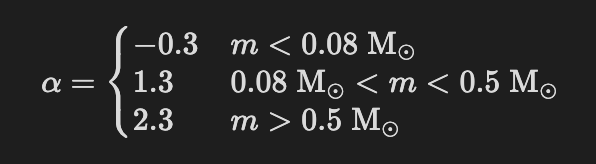 

	III) **Chabrier:** power-law with log-normal bottom 
	
	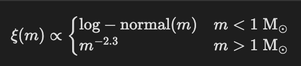

	
	
	The IMF is commonly inferred from the **present day mass function** using stellar evolution models. We do this because there are not enough young star clusters nearby to directly measure the IMF. The PDMF is inferred from an HR diagram. The low mass end is hard to constrain because those stars are faint and light is dust attenuated and high mass end is hard because they are so short lived. 
 
20. What are the theoretical and observational constraints on the mass-radius relationship for (i) white dwarfs and (ii) neutron stars?

	**White Dwarfs)** We can find the R(M) relation for WDs by interpolating between the degenerate E.O.S in the non-relativistic and ultra-relativistic limit. One can do it more accurately by interpolating between $n=3/2$ and $n=3$ polytropes (see Q15). The outcome is 
	
	$$R \sim \frac{K_1}{0.42 G M^{1/3}} \left( 1 - \left( \frac{M}{M_{\rm ch}} \right)^{4/3} \right)^{1/2}$$
	
	with $M_{\rm ch} \sim 1.4 \; \rm M_\odot (2 Y_e)^2$. If one wants a detailed relation, you need to determine the radius that minimizes the energy at a given mass, this requires detailed E.O.S modeling. 

	Constraints on R(M) come from the binary mass function using astrometry with GAIA for example or spectroscopy. If the WD is in a binary that is also eclipsing/transiting then we can get a radius too! The radius can be constrained from the Stephan-Boltzmann law using spectroscopic measurements of effective temperature with SDSS or HST. 

	**Neutron Stars)** The R(M) is not well constrained for NS so we have a variety of different models and this is still an open area of research. We do have a **maximum-mass** determined by the **Oppenheimer-Volkov (TOV) Limit**, where the contribution of energy density associated with pressure to the gravity fails and hydrostatic equilibrium becomes impossible. In this case $M_{\rm TOV} \sim 2.3 \; \rm M_\odot$, but the exact value is uncertain. 

	Constraints on R(M) are lackluster. The TOV limit is constrained to $M_{\rm TOV} \gtrsim 2.1 \; \rm M_\odot$ from the most massive confirmed NSs. X-ray pulsations measured by NICER can constrain the NS radius. Gravitational waveforms of NS mergers can constrain tidal deformability, constraining NS EOS -> R(M). 

21. Compare and contrast Type Ia and Type II supernovae: their spectra, luminosities, power sources for the observed radiation, and possible causes.

	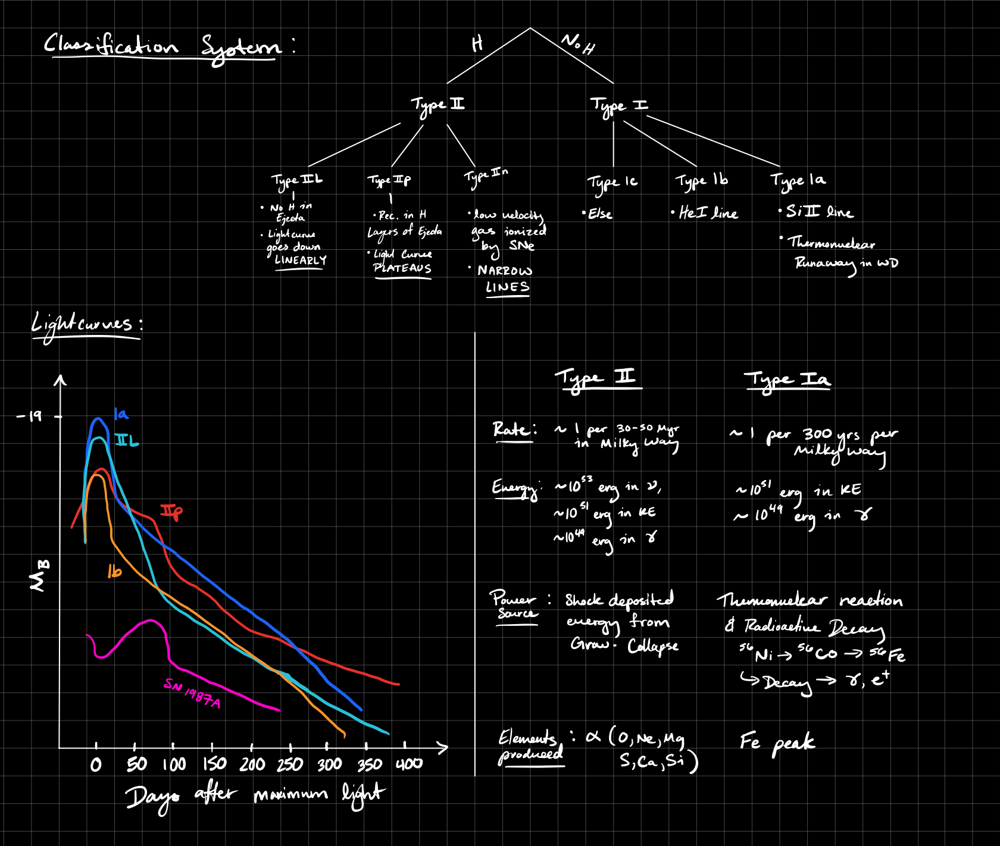

	**Type Ia:** Thermonuclear runaway triggered when $M > M_{\rm ch}$ (usually by accretion from a companion). These are used as standard candles via the **Phillips relation** which is a relationship between peak $m_B$ and decay in $m_B$ over 15 days. The scatter in the relation comes from different properties of the companion and its orbit. 

	**Type II:** Core collapse for $M \gtrsim 8 \; \rm M_\odot$, the core burns up to Fe & Ni and becomes inert and degenerate. It fail to hold up the star against gravity leading to collapse on the timescale of the free-fall time $t_{\rm ff} \sim (G\rho)^{-1/2}$. When $M_{\rm core} > M_{\rm ch}$ then we get core collapse which launches an outward shock and unbinds the stellar envelope creating ejecta. The core will either form a NS or BH depending on progenitor mass. The outward shock stalls due to inward acceleration and photodisentigration of heavy nuclei but then reaccelerates due to $\nu$-energy transport.  

22. Over what range of initial masses do stars become white dwarfs? Neutron stars? Black holes? What are the sources of uncertainty in these mass boundaries?

	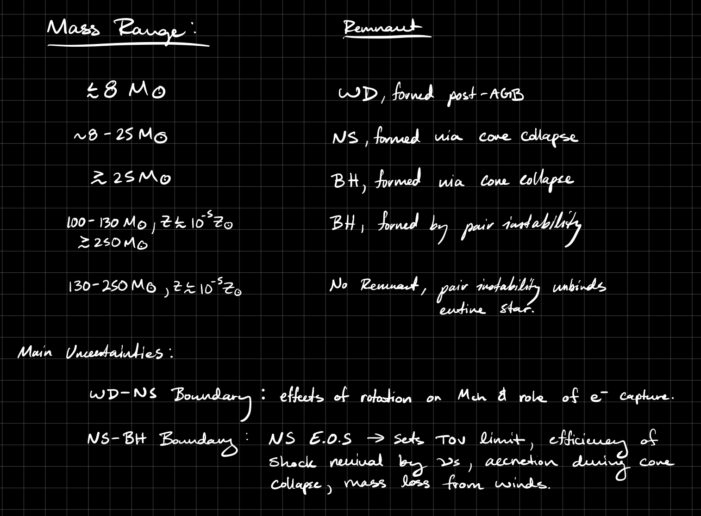